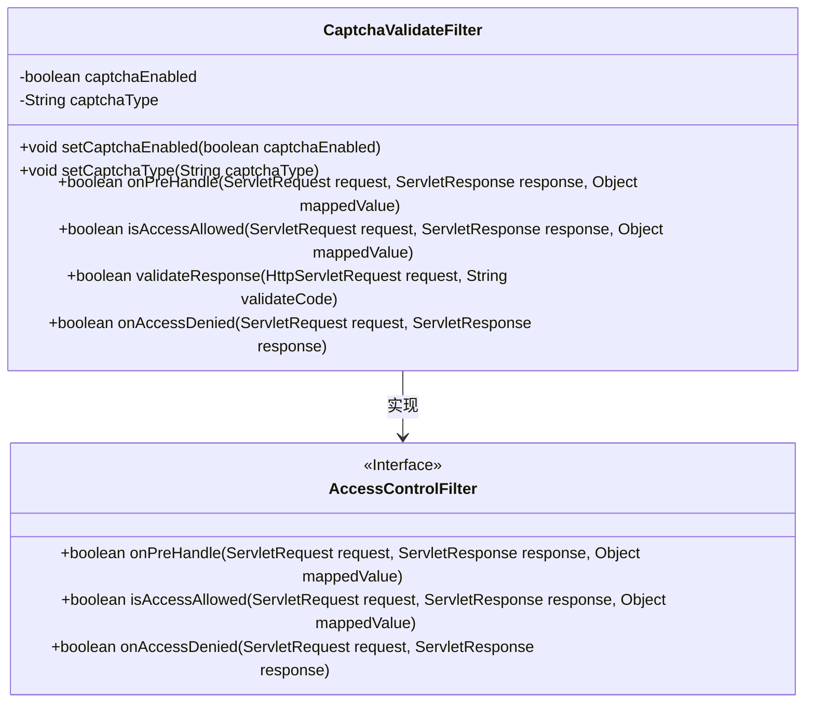
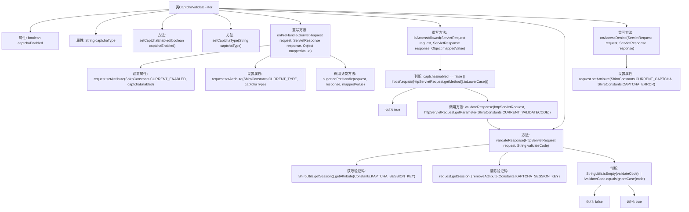

# 基础信息

|      |      |
|------|------|
| 编码语言 | .java |
| 代码路径 | RuoYi-framework/ruoyi-framework/src/main/java/com/ruoyi/framework/shiro/web/filter/captcha/CaptchaValidateFilter.java |
| 包名 | com.ruoyi.framework.shiro.web.filter.captcha |
| 依赖项 | ['javax.servlet.ServletRequest', 'javax.servlet.ServletResponse', 'javax.servlet.http.HttpServletRequest', 'org.apache.shiro.web.filter.AccessControlFilter', 'com.google.code.kaptcha.Constants', 'com.ruoyi.common.constant.ShiroConstants', 'com.ruoyi.common.utils.ShiroUtils', 'com.ruoyi.common.utils.StringUtils'] |
| 概述说明 | CaptchaValidateFilter类负责验证码验证，支持启用状态和类型设置，处理表单提交时的验证码校验。 |

# 说明

CaptchaValidateFilter类主要用于验证码验证功能，支持配置启用状态和验证码类型。在处理表单提交时，该类负责对用户输入的验证码进行校验，确保验证码的正确性。通过灵活的设置，可以适应不同场景下的验证码需求，提升系统的安全性和用户体验。

# 类列表 Class Summary

| 名称   | 类型  | 说明 |
|-------|------|-------------|
| CaptchaValidateFilter | class | CaptchaValidateFilter类用于验证码验证，支持启用状态和类型设置，处理表单提交时验证码校验。 |

## 类 CaptchaValidateFilter

|      |      |
|------|------|
| 访问范围 | public |
| 类型 | class |
| 名称 | CaptchaValidateFilter |
| 说明 | CaptchaValidateFilter类用于验证码验证，支持启用状态和类型设置，处理表单提交时验证码校验。 |

### UML类图

**描述：**
`CaptchaValidateFilter` 类继承自 `AccessControlFilter` 接口，用于处理验证码的验证逻辑。它包含两个私有属性 `captchaEnabled` 和 `captchaType`，分别表示是否启用验证码和验证码的类型。类中定义了多个方法，如 `onPreHandle`、`isAccessAllowed` 和 `validateResponse`，用于处理请求前的验证、访问权限的判断以及验证码的验证。`onAccessDenied` 方法用于处理访问被拒绝的情况。通过这些方法，`CaptchaValidateFilter` 实现了对验证码的全面控制和管理。

### 内部方法调用关系图

这段代码定义了一个名为`CaptchaValidateFilter`的类，用于处理验证码的验证逻辑。类中包含多个方法，用于设置验证码的启用状态和类型，以及在请求处理过程中进行验证码的验证。流程图展示了类中各方法的调用关系，以及验证码验证的逻辑流程。代码通过判断验证码是否启用、请求方法是否为POST，以及验证码是否正确来决定是否允许访问。

### 字段列表 Field List

| 名称  | 类型  | 说明 |
|-------|-------|------|
| captchaEnabled = true | boolean | 验证码功能已启用。 |
| captchaType = "math" | String | 验证码类型设置为数学计算。 |

### 方法列表 Method List

| 名称  | 类型  | 说明 |
|-------|-------|------|
| setCaptchaType | void | 设置验证码类型的方法。 |
| onPreHandle | boolean | 重写onPreHandle方法，设置请求属性并调用父类方法。 |
| setCaptchaEnabled | void | 设置验证码启用状态的方法。 |
| onAccessDenied | boolean | 处理访问拒绝时设置验证码错误属性并返回真。 |
| validateResponse | boolean | 验证请求中的验证码，清除后防止重复使用。 |
| isAccessAllowed | boolean | 验证码禁用或非表单提交时允许访问，否则验证响应。 |

