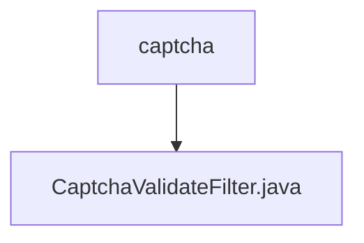

# 基础信息

|      |      |
|------|------|
| 编码语言 | .java |
| 代码路径 | RuoYi-framework/ruoyi-framework/src/main/java/com/ruoyi/framework/shiro/web/filter/captcha |
| 包名 | RuoYi-framework.ruoyi-framework.src.main.java.com.ruoyi.framework.shiro.web.filter.captcha |
| 概述说明 | CaptchaValidateFilter类负责验证码验证，支持启用状态和类型设置，处理表单提交时的验证码校验。 |

# 说明

CaptchaValidateFilter类主要用于验证码验证功能，支持配置启用状态和验证码类型。在处理表单提交时，该类负责对用户输入的验证码进行校验，确保验证码的正确性。通过灵活的设置，可以适应不同场景下的验证码需求，提升系统的安全性和用户体验。

### 包内部结构视图

流程图描述：该流程图展示了路径 `RuoYi-framework/ruoyi-framework/src/main/java/com/ruoyi/framework/shiro/web/filter/captcha` 的层级关系。`captcha` 是路径的最后一个文件夹，它包含一个文件 `CaptchaValidateFilter.java`。

# 文件列表 File List

| 名称   | 类型  | 说明 |
|-------|------|-------------|
| [CaptchaValidateFilter.java](CaptchaValidateFilter.md) | file | CaptchaValidateFilter类负责验证码验证，支持启用状态和类型设置，处理表单提交时的验证码校验。 |

