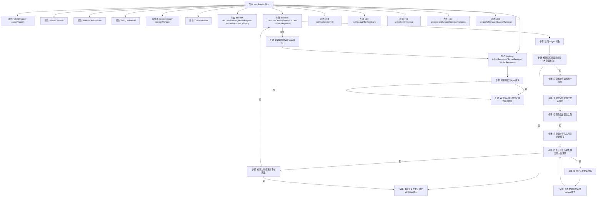

# 基础信息

|      |      |
|------|------|
| 编码语言 | .java |
| 代码路径 | RuoYi-framework/ruoyi-framework/src/main/java/com/ruoyi/framework/shiro/web/filter/kickout/KickoutSessionFilter.java |
| 包名 | com.ruoyi.framework.shiro.web.filter.kickout |
| 依赖项 | ['java.io.IOException', 'java.io.Serializable', 'java.util.ArrayDeque', 'java.util.Deque', 'javax.servlet.ServletRequest', 'javax.servlet.ServletResponse', 'javax.servlet.http.HttpServletRequest', 'javax.servlet.http.HttpServletResponse', 'org.apache.shiro.cache.Cache', 'org.apache.shiro.cache.CacheManager', 'org.apache.shiro.session.Session', 'org.apache.shiro.session.mgt.DefaultSessionKey', 'org.apache.shiro.session.mgt.SessionManager', 'org.apache.shiro.subject.Subject', 'org.apache.shiro.web.filter.AccessControlFilter', 'org.apache.shiro.web.util.WebUtils', 'com.fasterxml.jackson.databind.ObjectMapper', 'com.ruoyi.common.constant.ShiroConstants', 'com.ruoyi.common.core.domain.AjaxResult', 'com.ruoyi.common.core.domain.entity.SysUser', 'com.ruoyi.common.utils.ServletUtils', 'com.ruoyi.common.utils.ShiroUtils'] |
| 概述说明 | KickoutSessionFilter类管理用户会话，超限时踢出并重定向。 |

# 说明

KickoutSessionFilter类用于管理用户会话数量，当会话数超过设定限制时，会强制踢出旧的或新的会话，并将用户重定向到指定的URL。该功能有效控制会话资源，确保系统性能和用户体验。

# 类列表 Class Summary

| 名称   | 类型  | 说明 |
|-------|------|-------------|
| KickoutSessionFilter | class | KickoutSessionFilter类控制用户会话数，超限时踢出旧或新会话，并重定向至指定URL。 |


## 类 KickoutSessionFilter

|      |      |
|------|------|
| 访问范围 | public |
| 类型 | class |
| 名称 | KickoutSessionFilter |
| 说明 | KickoutSessionFilter类控制用户会话数，超限时踢出旧或新会话，并重定向至指定URL。 |


### UML类图

```mermaid
classDiagram
    class KickoutSessionFilter {
        -ObjectMapper objectMapper
        -int maxSession
        -Boolean kickoutAfter
        -String kickoutUrl
        -SessionManager sessionManager
        -Cache~String, Deque~Serializable~~ cache
        +KickoutSessionFilter()
        +void setMaxSession(int maxSession)
        +void setKickoutAfter(boolean kickoutAfter)
        +void setKickoutUrl(String kickoutUrl)
        +void setSessionManager(SessionManager sessionManager)
        +void setCacheManager(CacheManager cacheManager)
        +boolean isAccessAllowed(ServletRequest servletRequest, ServletResponse servletResponse, Object o)
        +boolean onAccessDenied(ServletRequest request, ServletResponse response)
        -boolean isAjaxResponse(ServletRequest request, ServletResponse response)
    }

    class AccessControlFilter {
        <<Interface>>
        +boolean isAccessAllowed(ServletRequest servletRequest, ServletResponse servletResponse, Object o)
        +boolean onAccessDenied(ServletRequest request, ServletResponse response)
    }

    class SessionManager {
        <<Interface>>
        +Session getSession(DefaultSessionKey key)
    }

    class CacheManager {
        <<Interface>>
        +Cache~String, Deque~Serializable~~ getCache(String name)
    }

    class Cache~K, V~ {
        <<Interface>>
        +V get(K key)
        +void put(K key, V value)
    }

    class ServletUtils {
        <<Interface>>
        +boolean isAjaxRequest(HttpServletRequest request)
        +void renderString(HttpServletResponse response, String string)
    }

    class WebUtils {
        <<Interface>>
        +void issueRedirect(ServletRequest request, ServletResponse response, String url)
    }

    class ShiroUtils {
        <<Interface>>
        +SysUser getSysUser()
    }

    class AjaxResult {
        +static AjaxResult error(String message)
    }

    KickoutSessionFilter --> AccessControlFilter : 继承
    KickoutSessionFilter --> SessionManager : 依赖
    KickoutSessionFilter --> CacheManager : 依赖
    KickoutSessionFilter --> Cache~String, Deque~Serializable~~ : 依赖
    KickoutSessionFilter --> ServletUtils : 依赖
    KickoutSessionFilter --> WebUtils : 依赖
    KickoutSessionFilter --> ShiroUtils : 依赖
    KickoutSessionFilter --> AjaxResult : 依赖
```

### 描述
`KickoutSessionFilter` 是一个用于控制用户会话的过滤器，继承自 `AccessControlFilter`。它通过 `SessionManager` 和 `Cache` 管理用户的会话，并根据配置的最大会话数决定是否踢出用户。如果用户被踢出，会根据请求类型（AJAX或普通请求）返回相应的响应。该过滤器还依赖于 `ServletUtils`、`WebUtils` 和 `ShiroUtils` 等工具类来实现其功能。


### 内部方法调用关系图



这段代码是一个用于控制用户会话的过滤器类 `KickoutSessionFilter`，它继承自 `AccessControlFilter`。其主要功能是限制同一用户的最大会话数，并在超出限制时踢出旧的或新的会话。代码通过 `onAccessDenied` 方法实现会话管理，包括会话队列的初始化、会话ID的存储、会话踢出逻辑以及重定向或Ajax响应的处理。流程图展示了类的主要属性和方法，以及 `onAccessDenied` 方法中的详细步骤。

### 字段列表 Field List

| 名称  | 类型  | 说明 |
|-------|-------|------|
| objectMapper = new ObjectMapper() | ObjectMapper | 私有静态ObjectMapper实例化。 |
| kickoutUrl | String | 私有字符串变量kickoutUrl。 |
| cache | Cache<String, Deque<Serializable>> | 私有缓存，存储字符串到可序列化队列的映射。 |
| kickoutAfter = false | Boolean | 私有布尔变量kickoutAfter初始值为false。 |
| maxSession = -1 | int | 最大会话数初始化为-1。 |
| sessionManager | SessionManager | 私有变量sessionManager，类型为SessionManager。 |

### 方法列表 Method List

| 名称  | 类型  | 说明 |
|-------|-------|------|
| setKickoutAfter | void | 设置踢出后的布尔值状态。 |
| setKickoutUrl | void | 设置踢出URL的方法。 |
| setMaxSession | void | 设置最大会话数的公共方法。 |
| setCacheManager | void | 设置缓存管理器，获取与配置一致的缓存实例。 |
| isAccessAllowed | boolean | 重写方法，禁止所有访问请求。 |
| isAjaxResponse | boolean | 检查请求是否为AJAX，是则返回错误信息，否则重定向。 |
| onAccessDenied | boolean | 检查用户登录状态，管理会话队列，超出最大会话数时踢出用户。 |
| setSessionManager | void | 设置会话管理器方法，将传入的会话管理器赋值给当前对象。 |


