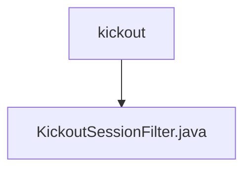

# 基础信息

|      |      |
|------|------|
| 编码语言 | .java |
| 代码路径 | RuoYi-framework/ruoyi-framework/src/main/java/com/ruoyi/framework/shiro/web/filter/kickout |
| 包名 | RuoYi-framework.ruoyi-framework.src.main.java.com.ruoyi.framework.shiro.web.filter.kickout |
| 概述说明 | KickoutSessionFilter类管理用户会话，超限时踢出并重定向。 |

# 说明

KickoutSessionFilter类用于管理用户会话数量，当会话数超过设定限制时，会强制踢出旧的或新的会话，并将用户重定向到指定的URL。该功能有效控制会话资源，确保系统性能和用户体验。

### 包内部结构视图

该流程图展示了路径的层级关系，`kickout`文件夹下包含一个文件`KickoutSessionFilter.java`。这种结构清晰地表示了文件在文件夹中的位置关系，便于理解和维护代码结构。

# 文件列表 File List

| 名称   | 类型  | 说明 |
|-------|------|-------------|
| [KickoutSessionFilter.java](KickoutSessionFilter.md) | file | KickoutSessionFilter类管理用户会话，超限时踢出并重定向。 |

