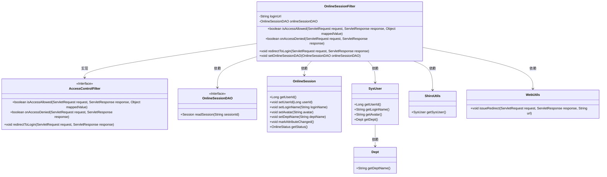
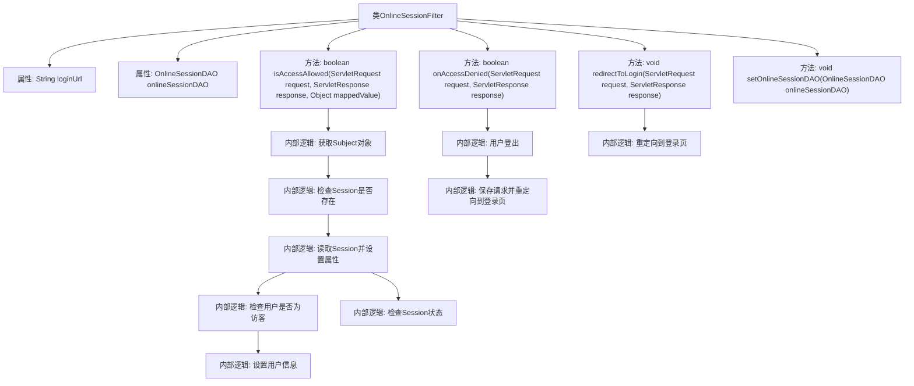

# 基础信息

|      |      |
|------|------|
| 编码语言 | .java |
| 代码路径 | RuoYi-framework/ruoyi-framework/src/main/java/com/ruoyi/framework/shiro/web/filter/online/OnlineSessionFilter.java |
| 包名 | com.ruoyi.framework.shiro.web.filter.online |
| 依赖项 | ['java.io.IOException', 'javax.servlet.ServletRequest', 'javax.servlet.ServletResponse', 'org.apache.shiro.session.Session', 'org.apache.shiro.subject.Subject', 'org.apache.shiro.web.filter.AccessControlFilter', 'org.apache.shiro.web.util.WebUtils', 'org.springframework.beans.factory.annotation.Value', 'com.ruoyi.common.constant.ShiroConstants', 'com.ruoyi.common.core.domain.entity.SysUser', 'com.ruoyi.common.enums.OnlineStatus', 'com.ruoyi.common.utils.ShiroUtils', 'com.ruoyi.framework.shiro.session.OnlineSession', 'com.ruoyi.framework.shiro.session.OnlineSessionDAO'] |
| 概述说明 | OnlineSessionFilter类管理在线会话访问，处理请求和登录重定向。 |

# 说明

OnlineSessionFilter类的主要功能是管理在线会话的访问控制，能够根据设定条件允许或拒绝用户的请求，并在需要时处理登录重定向操作。

# 类列表 Class Summary

| 名称   | 类型  | 说明 |
|-------|------|-------------|
| OnlineSessionFilter | class | OnlineSessionFilter类用于控制在线会话访问，允许或拒绝请求并处理登录重定向。 |

## 类 OnlineSessionFilter

|      |      |
|------|------|
| 访问范围 | public |
| 类型 | class |
| 名称 | OnlineSessionFilter |
| 说明 | OnlineSessionFilter类用于控制在线会话访问，允许或拒绝请求并处理登录重定向。 |

### UML类图

**描述**：该代码展示了`OnlineSessionFilter`类，它继承自`AccessControlFilter`接口，用于控制用户会话的访问权限。`OnlineSessionFilter`依赖于`OnlineSessionDAO`来读取会话信息，并通过`OnlineSession`对象管理用户会话状态。它还通过`ShiroUtils`获取系统用户信息，并在访问被拒绝时使用`WebUtils`重定向到登录页面。整个过程涉及多个类的协作，确保会话管理的安全性和有效性。

### 内部方法调用关系图

这段代码定义了一个名为`OnlineSessionFilter`的类，继承自`AccessControlFilter`。该类主要用于处理用户会话的访问控制，包括检查会话状态、处理访客用户、以及在访问被拒绝时进行重定向。代码通过`isAccessAllowed`方法检查用户会话是否允许访问，并通过`onAccessDenied`方法处理访问被拒绝的情况。此外，`redirectToLogin`方法用于将用户重定向到登录页面。整体逻辑清晰，涵盖了会话管理的多个方面。

### 字段列表 Field List

| 名称  | 类型  | 说明 |
|-------|-------|------|
| onlineSessionDAO | OnlineSessionDAO | 私有变量onlineSessionDAO用于在线会话数据访问。 |
| loginUrl | String | Shiro配置中定义了用户登录URL路径。 |

### 方法列表 Method List

| 名称  | 类型  | 说明 |
|-------|-------|------|
| redirectToLogin | void | 重写方法，通过WebUtils将请求重定向至登录页面。 |
| onAccessDenied | boolean | 访问被拒时，用户登出并重定向至登录页面。 |
| setOnlineSessionDAO | void | 该方法用于设置在线会话DAO对象。 |
| isAccessAllowed | boolean | 检查用户会话状态，更新在线会话信息，并返回访问权限结果。 |

