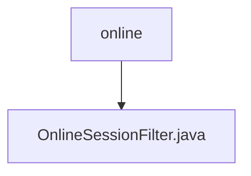

# 基础信息

|      |      |
|------|------|
| 编码语言 | .java |
| 代码路径 | RuoYi-framework/ruoyi-framework/src/main/java/com/ruoyi/framework/shiro/web/filter/online |
| 包名 | RuoYi-framework.ruoyi-framework.src.main.java.com.ruoyi.framework.shiro.web.filter.online |
| 概述说明 | OnlineSessionFilter类管理在线会话访问，处理请求和登录重定向。 |

# 说明

OnlineSessionFilter类的主要功能是管理在线会话的访问控制，能够根据设定条件允许或拒绝用户的请求，并在需要时处理登录重定向操作。

### 包内部结构视图

该流程图展示了路径的层级关系，`online` 是父节点，`OnlineSessionFilter.java` 是其子节点。路径结构简单明了，反映了文件在目录中的具体位置。

# 文件列表 File List

| 名称   | 类型  | 说明 |
|-------|------|-------------|
| [OnlineSessionFilter.java](OnlineSessionFilter.md) | file | OnlineSessionFilter类管理在线会话访问，处理请求和登录重定向。 |

