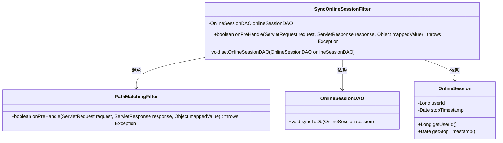

# 基础信息

|      |      |
|------|------|
| 编码语言 | .java |
| 代码路径 | RuoYi-framework/ruoyi-framework/src/main/java/com/ruoyi/framework/shiro/web/filter/sync/SyncOnlineSessionFilter.java |
| 包名 | com.ruoyi.framework.shiro.web.filter.sync |
| 依赖项 | ['javax.servlet.ServletRequest', 'javax.servlet.ServletResponse', 'org.apache.shiro.web.filter.PathMatchingFilter', 'com.ruoyi.common.constant.ShiroConstants', 'com.ruoyi.framework.shiro.session.OnlineSession', 'com.ruoyi.framework.shiro.session.OnlineSessionDAO'] |
| 概述说明 | SyncOnlineSessionFilter类用于同步在线会话数据，确保每次请求最多同步一次。 |

# 说明

SyncOnlineSessionFilter类的主要功能是将在线会话数据同步到数据库，其设计目标是确保每次请求最多只进行一次同步操作。该类的核心作用是避免重复同步，提高数据处理效率，并确保数据的一致性和准确性。通过这一机制，系统能够有效管理在线会话数据，减少不必要的数据库操作，从而优化整体性能。

# 类列表 Class Summary

| 名称   | 类型  | 说明 |
|-------|------|-------------|
| SyncOnlineSessionFilter | class | SyncOnlineSessionFilter类用于同步在线会话数据到数据库，确保每次请求最多同步一次。 |

## 类 SyncOnlineSessionFilter

|      |      |
|------|------|
| 访问范围 | public |
| 类型 | class |
| 名称 | SyncOnlineSessionFilter |
| 说明 | SyncOnlineSessionFilter类用于同步在线会话数据到数据库，确保每次请求最多同步一次。 |

### UML类图

这段代码定义了一个名为 `SyncOnlineSessionFilter` 的类，它继承自 `PathMatchingFilter`。`SyncOnlineSessionFilter` 类的主要功能是在请求处理之前，将在线会话数据同步到数据库中。它依赖于 `OnlineSessionDAO` 类来执行数据库同步操作，并且通过 `OnlineSession` 类获取会话信息。`SyncOnlineSessionFilter` 类通过 `onPreHandle` 方法检查会话状态，并在会话未停止时调用 `onlineSessionDAO.syncToDb` 方法进行数据同步。

### 内部方法调用关系图

**描述：** 该代码定义了一个`SyncOnlineSessionFilter`类，继承自`PathMatchingFilter`，用于在请求处理前同步会话数据到数据库。`onPreHandle`方法首先从请求中获取`OnlineSession`对象，然后检查该会话是否有效（即会话不为空、用户ID不为空且会话未停止）。如果会话有效，则调用`onlineSessionDAO.syncToDb`方法将会话数据同步到数据库，最后返回`true`表示继续处理请求。

### 字段列表 Field List

| 名称  | 类型  | 说明 |
|-------|-------|------|
| onlineSessionDAO | OnlineSessionDAO | 私有变量onlineSessionDAO用于在线会话数据访问。 |

### 方法列表 Method List

| 名称  | 类型  | 说明 |
|-------|-------|------|
| setOnlineSessionDAO | void | 设置在线会话DAO实例。 |
| onPreHandle | boolean | 检查在线会话状态，若未停止则同步至数据库。 |

