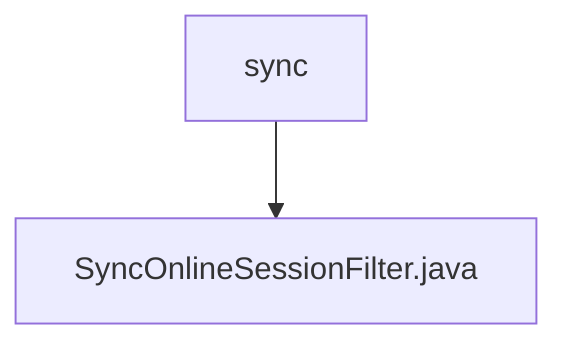

# 基础信息

|      |      |
|------|------|
| 编码语言 | .java |
| 代码路径 | RuoYi-framework/ruoyi-framework/src/main/java/com/ruoyi/framework/shiro/web/filter/sync |
| 包名 | RuoYi-framework.ruoyi-framework.src.main.java.com.ruoyi.framework.shiro.web.filter.sync |
| 概述说明 | SyncOnlineSessionFilter类用于同步在线会话数据，确保每次请求最多同步一次。 |

# 说明

SyncOnlineSessionFilter类的主要功能是将在线会话数据同步到数据库，其设计目标是确保每次请求最多只进行一次同步操作。该类的核心作用是避免重复同步，提高数据处理效率，并确保数据的一致性和准确性。通过这一机制，系统能够有效管理在线会话数据，减少不必要的数据库操作，从而优化整体性能。

### 包内部结构视图

该流程图展示了路径的层级关系，其中`sync`文件夹包含一个名为`SyncOnlineSessionFilter.java`的文件。通过简洁的节点连接，清晰地表示了文件夹与文件之间的从属关系。

# 文件列表 File List

| 名称   | 类型  | 说明 |
|-------|------|-------------|
| [SyncOnlineSessionFilter.java](SyncOnlineSessionFilter.md) | file | SyncOnlineSessionFilter类用于同步在线会话数据，确保每次请求最多同步一次。 |

