# 基础信息

|      |      |
|------|------|
| 编码语言 | .java |
| 代码路径 | RuoYi-framework/ruoyi-framework/src/main/java/com/ruoyi/framework/shiro/web/session/OnlineWebSessionManager.java |
| 包名 | com.ruoyi.framework.shiro.web.session |
| 依赖项 | ['java.util.ArrayList', 'java.util.Collection', 'java.util.Date', 'java.util.List', 'org.apache.commons.lang3.time.DateUtils', 'org.apache.shiro.session.ExpiredSessionException', 'org.apache.shiro.session.InvalidSessionException', 'org.apache.shiro.session.Session', 'org.apache.shiro.session.mgt.DefaultSessionKey', 'org.apache.shiro.session.mgt.SessionKey', 'org.apache.shiro.web.session.mgt.DefaultWebSessionManager', 'org.slf4j.Logger', 'org.slf4j.LoggerFactory', 'com.ruoyi.common.constant.ShiroConstants', 'com.ruoyi.common.utils.StringUtils', 'com.ruoyi.common.utils.bean.BeanUtils', 'com.ruoyi.common.utils.spring.SpringUtils', 'com.ruoyi.framework.shiro.session.OnlineSession', 'com.ruoyi.system.domain.SysUserOnline', 'com.ruoyi.system.service.ISysUserOnlineService'] |
| 概述说明 | OnlineWebSessionManager扩展DefaultWebSessionManager，管理会话属性和验证过期会话。 |

# 说明

OnlineWebSessionManager扩展了DefaultWebSessionManager，主要负责管理在线会话的属性，并验证会话是否过期。该管理器通过继承DefaultWebSessionManager的功能，进一步增强了会话管理的灵活性和安全性，确保在线会话的有效性和及时清理过期会话。

# 类列表 Class Summary

| 名称   | 类型  | 说明 |
|-------|------|-------------|
| OnlineWebSessionManager | class | OnlineWebSessionManager扩展DefaultWebSessionManager，管理在线会话属性和验证过期会话。 |

## 类 OnlineWebSessionManager

|      |      |
|------|------|
| 访问范围 | public |
| 类型 | class |
| 名称 | OnlineWebSessionManager |
| 说明 | OnlineWebSessionManager扩展DefaultWebSessionManager，管理在线会话属性和验证过期会话。 |

### UML类图

```mermaid
classDiagram
    class DefaultWebSessionManager {
        <<Abstract>>
        +setAttribute(SessionKey sessionKey, Object attributeKey, Object value) void
        +removeAttribute(SessionKey sessionKey, Object attributeKey) Object
        +validateSessions() void
        +getActiveSessions() Collection~Session~
    }

    class OnlineWebSessionManager {
        -Logger log
        +setAttribute(SessionKey sessionKey, Object attributeKey, Object value) void
        +removeAttribute(SessionKey sessionKey, Object attributeKey) Object
        +getOnlineSession(SessionKey sessionKey) OnlineSession
        +validateSessions() void
        +getActiveSessions() Collection~Session~
        -needMarkAttributeChanged(Object attributeKey) boolean
    }

    class OnlineSession {
        +markAttributeChanged() void
    }

    class ISysUserOnlineService {
        <<Interface>>
        +selectOnlineByExpired(Date expiredDate) List~SysUserOnline~
        +removeUserCache(String loginName, String sessionId) void
        +batchDeleteOnline(List~String~ sessionIds) void
    }

    class SysUserOnline {
        +getSessionId() String
        +getLoginName() String
    }

    class SessionKey {
        <<Abstract>>
    }

    class DefaultSessionKey {
        +DefaultSessionKey(String sessionId)
    }

    class Session {
        <<Abstract>>
    }

    class InvalidSessionException {
        <<Exception>>
    }

    class ExpiredSessionException {
        <<Exception>>
    }

    class BeanUtils {
        <<Utility>>
        +copyBeanProp(Object dest, Object src) void
    }

    class StringUtils {
        <<Utility>>
        +isNotNull(Object obj) boolean
    }

    class DateUtils {
        <<Utility>>
        +addMilliseconds(Date date, int amount) Date
    }

    class SpringUtils {
        <<Utility>>
        +getBean(Class~T~ clazz) T
    }

    OnlineWebSessionManager --> DefaultWebSessionManager : 继承
    OnlineWebSessionManager --> OnlineSession : 创建
    OnlineWebSessionManager --> ISysUserOnlineService : 依赖
    OnlineWebSessionManager --> SessionKey : 依赖
    OnlineWebSessionManager --> Session : 依赖
    OnlineWebSessionManager --> InvalidSessionException : 依赖
    OnlineWebSessionManager --> ExpiredSessionException : 依赖
    OnlineWebSessionManager --> BeanUtils : 依赖
    OnlineWebSessionManager --> StringUtils : 依赖
    OnlineWebSessionManager --> DateUtils : 依赖
    OnlineWebSessionManager --> SpringUtils : 依赖
    ISysUserOnlineService --> SysUserOnline : 依赖
    SessionKey --> DefaultSessionKey : 继承
```

### 描述
`OnlineWebSessionManager` 继承自 `DefaultWebSessionManager`，负责管理在线会话。它通过重写 `setAttribute` 和 `removeAttribute` 方法，在设置或移除会话属性时标记会话属性变化。`validateSessions` 方法用于验证会话是否过期，并删除过期会话。`getOnlineSession` 方法用于获取在线会话。`OnlineWebSessionManager` 依赖 `ISysUserOnlineService` 进行在线用户管理，并通过 `SessionKey` 和 `Session` 类处理会话。此外，它还依赖多个工具类如 `BeanUtils`、`StringUtils`、`DateUtils` 和 `SpringUtils` 来实现功能。

### 内部方法调用关系图

```mermaid
graph TD
    A["类OnlineWebSessionManager"]
    B["属性: Logger log"]
    C["方法: setAttribute(SessionKey sessionKey, Object attributeKey, Object value)"]
    D["方法: needMarkAttributeChanged(Object attributeKey)"]
    E["方法: removeAttribute(SessionKey sessionKey, Object attributeKey)"]
    F["方法: getOnlineSession(SessionKey sessionKey)"]
    G["方法: validateSessions()"]
    H["方法: getActiveSessions()"]

    A --> B
    A --> C
    A --> D
    A --> E
    A --> F
    A --> G
    A --> H

    C --> C1["调用父类方法: super.setAttribute(sessionKey, attributeKey, value)"]
    C --> C2["调用方法: needMarkAttributeChanged(attributeKey)"]
    C2 --> C3["调用方法: getOnlineSession(sessionKey)"]
    C3 --> C4["调用方法: session.markAttributeChanged()"]

    D --> D1["判断: attributeKey == null"]
    D1 --> D2["返回: false"]
    D --> D3["转换: attributeKeyStr = attributeKey.toString()"]
    D3 --> D4["判断: attributeKeyStr.startsWith('org.springframework')"]
    D4 --> D5["返回: false"]
    D3 --> D6["判断: attributeKeyStr.startsWith('javax.servlet')"]
    D6 --> D7["返回: false"]
    D3 --> D8["判断: attributeKeyStr.equals(ShiroConstants.CURRENT_USERNAME)"]
    D8 --> D9["返回: false"]
    D3 --> D10["返回: true"]

    E --> E1["调用父类方法: super.removeAttribute(sessionKey, attributeKey)"]
    E1 --> E2["判断: removed != null"]
    E2 --> E3["调用方法: getOnlineSession(sessionKey)"]
    E3 --> E4["调用方法: s.markAttributeChanged()"]
    E1 --> E5["返回: removed"]

    F --> F1["调用方法: doGetSession(sessionKey)"]
    F1 --> F2["判断: StringUtils.isNotNull(obj)"]
    F2 --> F3["创建对象: session = new OnlineSession()"]
    F3 --> F4["调用方法: BeanUtils.copyBeanProp(session, obj)"]
    F2 --> F5["返回: session"]

    G --> G1["判断: log.isInfoEnabled()"]
    G1 --> G2["记录日志: log.info('invalidation sessions...')"]
    G --> G3["获取: timeout = this.getGlobalSessionTimeout()"]
    G3 --> G4["判断: timeout < 0"]
    G4 --> G5["返回"]
    G3 --> G6["计算: expiredDate = DateUtils.addMilliseconds(new Date(), 0 - timeout)"]
    G6 --> G7["获取: userOnlineService = SpringUtils.getBean(ISysUserOnlineService.class)"]
    G7 --> G8["调用方法: userOnlineService.selectOnlineByExpired(expiredDate)"]
    G8 --> G9["遍历: for (SysUserOnline userOnline : userOnlineList)"]
    G9 --> G10["创建: key = new DefaultSessionKey(userOnline.getSessionId())"]
    G10 --> G11["调用方法: retrieveSession(key)"]
    G11 --> G12["判断: session != null"]
    G12 --> G13["抛出异常: throw new InvalidSessionException()"]
    G11 --> G14["捕获异常: catch (InvalidSessionException e)"]
    G14 --> G15["判断: log.isDebugEnabled()"]
    G15 --> G16["记录日志: log.debug(msg)"]
    G14 --> G17["增加: invalidCount++"]
    G14 --> G18["添加: needOfflineIdList.add(userOnline.getSessionId())"]
    G14 --> G19["调用方法: userOnlineService.removeUserCache(userOnline.getLoginName(), userOnline.getSessionId())"]
    G9 --> G20["判断: needOfflineIdList.size() > 0"]
    G20 --> G21["调用方法: userOnlineService.batchDeleteOnline(needOfflineIdList)"]
    G21 --> G22["捕获异常: catch (Exception e)"]
    G22 --> G23["记录日志: log.error('batch delete db session error.', e)"]
    G --> G24["判断: log.isInfoEnabled()"]
    G24 --> G25["记录日志: log.info(msg)"]
```

**流程图描述：**

该流程图展示了`OnlineWebSessionManager`类的主要方法和它们之间的调用关系。`setAttribute`方法首先调用父类方法设置属性，然后根据`needMarkAttributeChanged`方法的判断结果决定是否标记属性更改。`removeAttribute`方法在移除属性后，如果移除的值不为空，则标记属性更改。`getOnlineSession`方法通过`doGetSession`获取会话对象并复制属性。`validateSessions`方法用于验证会话是否有效，并处理过期会话，记录日志并批量删除过期会话。`getActiveSessions`方法抛出未支持的操作异常。

### 字段列表 Field List

| 名称  | 类型  | 说明 |
|-------|-------|------|
| log = LoggerFactory.getLogger(OnlineWebSessionManager.class) | Logger | OnlineWebSessionManager类中定义了一个私有的静态日志记录器。 |

### 方法列表 Method List

| 名称  | 类型  | 说明 |
|-------|-------|------|
| getActiveSessions | Collection<Session> | getActiveSessions方法未实现，抛出UnsupportedOperationException异常。 |
| needMarkAttributeChanged | boolean | 检查属性键是否需要标记变更，排除特定前缀和固定值。 |
| validateSessions | void | 验证并清理过期会话，统计并批量删除无效会话。 |
| removeAttribute | Object | 重写removeAttribute方法，删除属性并标记会话属性变更。 |
| setAttribute | void | 重写setAttribute方法，调用父类方法后，若值非空且需标记属性变更，则标记会话属性变更。 |
| getOnlineSession | OnlineSession | 根据SessionKey获取OnlineSession，若存在则复制属性并返回。 |

