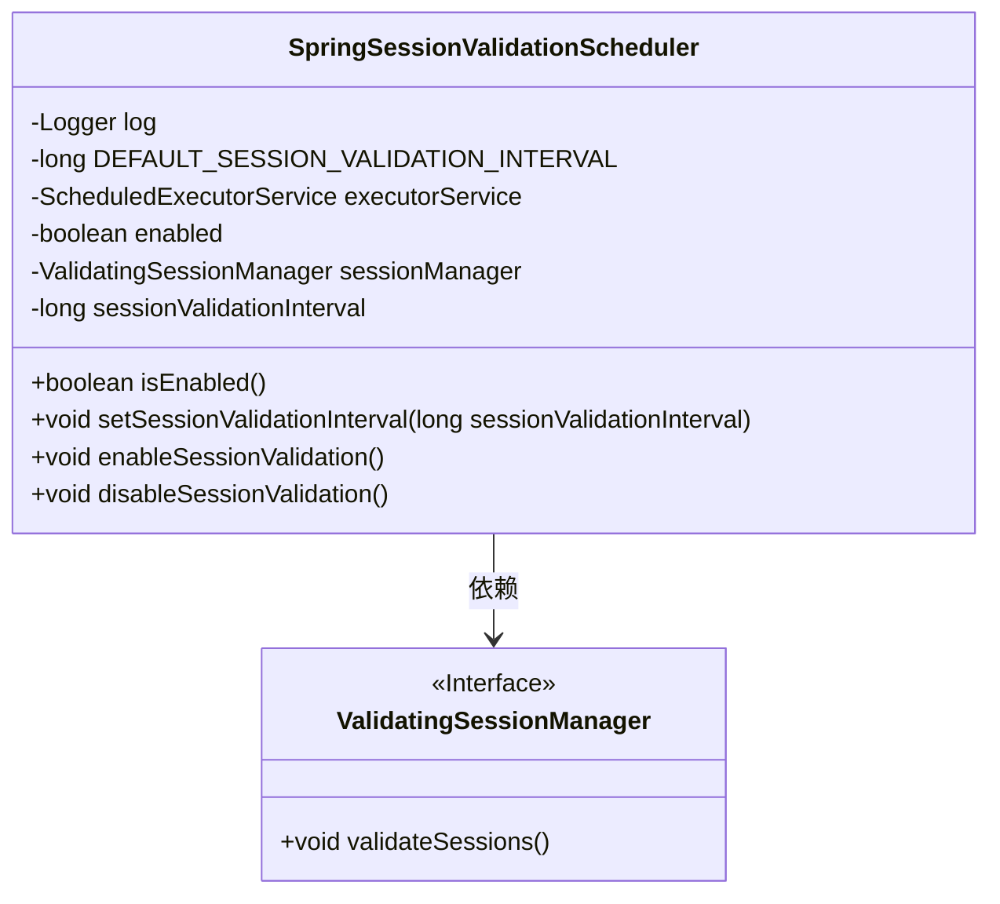
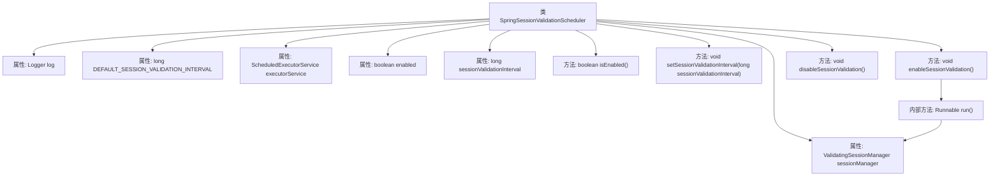

# 基础信息

|      |      |
|------|------|
| 编码语言 | .java |
| 代码路径 | RuoYi-framework/ruoyi-framework/src/main/java/com/ruoyi/framework/shiro/web/session/SpringSessionValidationScheduler.java |
| 包名 | com.ruoyi.framework.shiro.web.session |
| 依赖项 | ['java.util.concurrent.ScheduledExecutorService', 'java.util.concurrent.TimeUnit', 'org.apache.shiro.session.mgt.DefaultSessionManager', 'org.apache.shiro.session.mgt.SessionValidationScheduler', 'org.apache.shiro.session.mgt.ValidatingSessionManager', 'org.slf4j.Logger', 'org.slf4j.LoggerFactory', 'org.springframework.beans.factory.annotation.Autowired', 'org.springframework.beans.factory.annotation.Qualifier', 'org.springframework.beans.factory.annotation.Value', 'org.springframework.context.annotation.Lazy', 'org.springframework.stereotype.Component', 'com.ruoyi.common.utils.Threads'] |
| 概述说明 | SpringSessionValidationScheduler类定时验证会话有效性，支持启用和禁用功能。 |

# 说明

SpringSessionValidationScheduler类是一个用于定时验证会话有效性的工具，其主要功能包括支持启用和禁用会话验证功能。通过该类，用户可以配置和管理会话验证的调度，确保会话在设定的时间间隔内进行有效性检查，从而维护系统的安全性和稳定性。该类为开发者提供了灵活的会话管理机制，适用于需要定期验证会话的场景。

# 类列表 Class Summary

| 名称   | 类型  | 说明 |
|-------|------|-------------|
| SpringSessionValidationScheduler | class | SpringSessionValidationScheduler类用于定时验证会话有效性，支持启用和禁用验证功能。 |

## 类 SpringSessionValidationScheduler

|      |      |
|------|------|
| 访问范围 | @Component;public |
| 类型 | class |
| 名称 | SpringSessionValidationScheduler |
| 说明 | SpringSessionValidationScheduler类用于定时验证会话有效性，支持启用和禁用验证功能。 |

### UML类图

**描述：**  
`SpringSessionValidationScheduler` 类是一个用于调度会话验证的组件，依赖于 `ValidatingSessionManager` 接口来执行会话验证。该类通过 `ScheduledExecutorService` 定期调用 `validateSessions` 方法，以确保会话的有效性。`enableSessionValidation` 方法启动会话验证任务，而 `disableSessionValidation` 方法则停止该任务。类中还包含了对会话验证间隔时间的配置和管理。

### 内部方法调用关系图

这段代码描述了一个Spring会话验证调度器类`SpringSessionValidationScheduler`，它负责定时验证会话的有效性。类中包含多个属性和方法，如`ScheduledExecutorService`用于调度任务，`ValidatingSessionManager`用于验证会话，`enableSessionValidation`方法用于启动会话验证任务，`disableSessionValidation`方法用于停止会话验证任务。流程图展示了类中各个属性和方法之间的调用关系，特别是`enableSessionValidation`方法内部通过`Runnable`调用`sessionManager.validateSessions()`来执行会话验证的逻辑。

### 字段列表 Field List

| 名称  | 类型  | 说明 |
|-------|-------|------|
| sessionValidationInterval | long | Shiro会话验证间隔时间配置。 |
| DEFAULT_SESSION_VALIDATION_INTERVAL = DefaultSessionManager.DEFAULT_SESSION_VALIDATION_INTERVAL | long | 默认会话验证间隔设置为DefaultSessionManager的默认值。 |
| enabled = false | boolean | 私有易变布尔变量enabled初始值为false。 |
| sessionManager | ValidatingSessionManager | 使用@Autowired、@Qualifier和@Lazy注解注入ValidatingSessionManager实例。 |
| log = LoggerFactory.getLogger(SpringSessionValidationScheduler.class) | Logger | SpringSessionValidationScheduler类中定义了一个静态的日志记录器。 |
| executorService | ScheduledExecutorService | 使用Autowired和Qualifier注入指定的ScheduledExecutorService实例。 |

### 方法列表 Method List

| 名称  | 类型  | 说明 |
|-------|-------|------|
| setSessionValidationInterval | void | 设置会话验证间隔时间。 |
| isEnabled | boolean | 重写isEnabled方法，返回enabled属性值。 |
| enableSessionValidation | void | 启用会话验证，使用Spring Scheduler定期执行会话验证任务。 |
| disableSessionValidation | void | 禁用会话验证，停止Spring调度器任务，关闭执行服务，设置状态为禁用。 |

