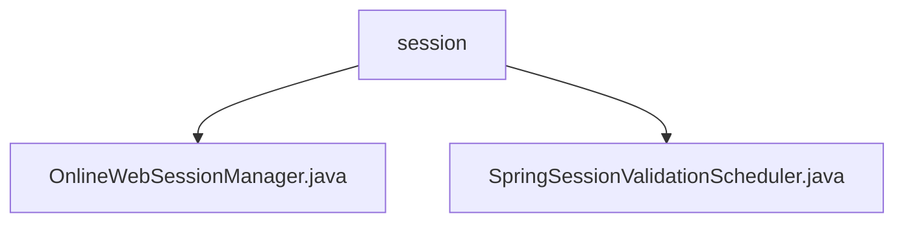

# 基础信息

|      |      |
|------|------|
| 编码语言 | .java |
| 代码路径 | RuoYi-framework/ruoyi-framework/src/main/java/com/ruoyi/framework/shiro/web/session |
| 包名 | RuoYi-framework.ruoyi-framework.src.main.java.com.ruoyi.framework.shiro.web.session |
| 概述说明 | OnlineWebSessionManager管理在线会话，验证过期；SpringSessionValidationScheduler定时验证会话，确保系统安全。 |

# 说明

OnlineWebSessionManager扩展了DefaultWebSessionManager，专注于管理在线会话属性并验证会话是否过期，增强了会话管理的灵活性和安全性，确保有效会话的及时清理。SpringSessionValidationScheduler类是一个定时验证会话有效性的工具，支持启用和禁用会话验证功能，允许用户配置和管理会话验证的调度，确保会话在设定时间间隔内进行有效性检查，维护系统安全性和稳定性，适用于需要定期验证会话的场景。

### 包内部结构视图

该流程图展示了RuoYi框架中`shiro`模块下的`session`文件夹及其包含的两个Java文件：`OnlineWebSessionManager.java`和`SpringSessionValidationScheduler.java`。`session`作为父节点，直接关联到这两个文件，清晰地反映了它们的层级关系。

# 文件列表 File List

| 名称   | 类型  | 说明 |
|-------|------|-------------|
| [SpringSessionValidationScheduler.java](SpringSessionValidationScheduler.md) | file | SpringSessionValidationScheduler类定时验证会话有效性，支持启用和禁用功能。 |
| [OnlineWebSessionManager.java](OnlineWebSessionManager.md) | file | OnlineWebSessionManager扩展DefaultWebSessionManager，管理会话属性和验证过期会话。 |

