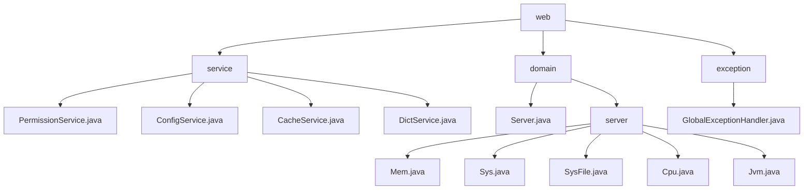

# 基础信息

|      |      |
|------|------|
| 编码语言 | .java |
| 代码路径 | RuoYi-framework/ruoyi-framework/src/main/java/com/ruoyi/framework/web |
| 包名 | RuoYi-framework.ruoyi-framework.src.main.java.com.ruoyi.framework.web |
| 概述说明 | 权限、配置、缓存、字典服务管理资源；服务器、内存、系统、CPU、JVM类监控优化；全局异常处理器提升系统健壮性。 |

# 说明

PermissionService类用于权限验证，判断用户访问资格，返回状态确保系统安全。ConfigService类查询配置信息，简化管理提高灵活性。CacheService类管理缓存，优化性能和数据一致性。DictService类查询字典数据，满足不同场景需求。Server类管理CPU、内存、JVM、服务器和磁盘信息，确保资源优化和高效运行。Mem类处理内存信息，包括总量、已用、剩余内存及使用率。Sys类管理服务器信息，如名称、IP、项目路径、操作系统和架构。SysFile类描述系统文件信息，包括盘符路径、类型、大小和使用率。CPU类表示CPU状态，包含核心数、使用率等属性。JVM类管理Java虚拟机内存、JDK版本、路径、启动时间和运行参数，支持监控和优化。全局异常处理器捕获和处理各类异常，生成错误信息返回给调用方，提高系统健壮性和用户体验。

### 包内部结构视图

该流程图展示了RuoYi框架中`web`目录下的层级结构。`web`目录包含`service`、`domain`和`exception`三个子目录。`service`目录下包含多个服务类文件，如`PermissionService.java`和`ConfigService.java`。`domain`目录下包含`Server.java`和`server`子目录，`server`子目录下又包含多个服务器相关类文件，如`Mem.java`和`Sys.java`。`exception`目录下包含`GlobalExceptionHandler.java`文件，用于全局异常处理。

# 文件列表 File List

| 名称   | 类型  | 说明 |
|-------|------|-------------|
| [exception](exception/_module.md) | package | 全局异常处理器处理权限、请求方式、运行时、系统、业务等异常，返回错误信息。 |
| [domain](domain/_module.md) | package | Server类管理CPU、内存、JVM、服务器和磁盘信息，提供查询和配置方法。Mem类处理内存信息，Sys类管理服务器信息，SysFile类描述系统文件状态，CPU类表示CPU状态，JVM类管理Java虚拟机信息。 |
| [service](service/_module.md) | package | PermissionService验证权限，ConfigService查询配置，CacheService管理缓存，DictService查询字典数据。 |

