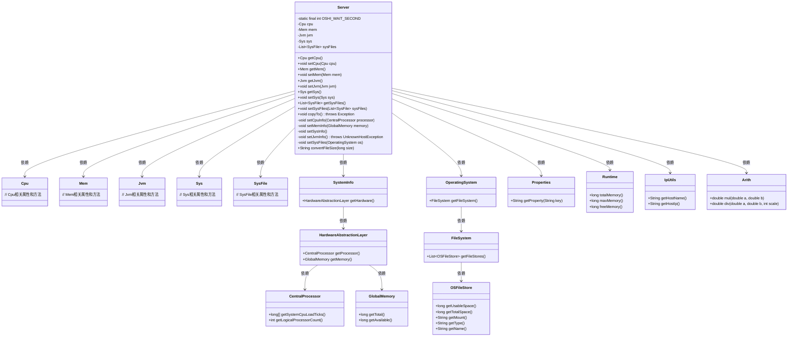

# 基础信息

|      |      |
|------|------|
| 编码语言 | .java |
| 代码路径 | RuoYi-framework/ruoyi-framework/src/main/java/com/ruoyi/framework/web/domain/Server.java |
| 包名 | com.ruoyi.framework.web.domain |
| 依赖项 | ['java.net.UnknownHostException', 'java.util.LinkedList', 'java.util.List', 'java.util.Properties', 'com.ruoyi.common.utils.Arith', 'com.ruoyi.common.utils.IpUtils', 'com.ruoyi.framework.web.domain.server.Cpu', 'com.ruoyi.framework.web.domain.server.Jvm', 'com.ruoyi.framework.web.domain.server.Mem', 'com.ruoyi.framework.web.domain.server.Sys', 'com.ruoyi.framework.web.domain.server.SysFile', 'oshi.SystemInfo', 'oshi.hardware.CentralProcessor', 'oshi.hardware.CentralProcessor.TickType', 'oshi.hardware.GlobalMemory', 'oshi.hardware.HardwareAbstractionLayer', 'oshi.software.os.FileSystem', 'oshi.software.os.OSFileStore', 'oshi.software.os.OperatingSystem', 'oshi.util.Util'] |
| 概述说明 | Server类管理CPU、内存、JVM、服务器和磁盘信息，并提供获取和设置方法。 |

# 说明

Server类负责管理CPU、内存、JVM、服务器和磁盘信息，提供获取和设置这些信息的方法。该类涵盖了服务器资源的关键方面，包括处理器、内存、Java虚拟机、服务器状态以及磁盘使用情况，通过其方法可以查询和配置这些资源，确保服务器的高效运行和资源优化。

# 类列表 Class Summary

| 名称   | 类型  | 说明 |
|-------|------|-------------|
| Server | class | Server类管理CPU、内存、JVM、服务器和磁盘信息，提供获取和设置方法。 |

## 类 Server

|      |      |
|------|------|
| 访问范围 | public |
| 类型 | class |
| 名称 | Server |
| 说明 | Server类管理CPU、内存、JVM、服务器和磁盘信息，提供获取和设置方法。 |

### UML类图

**描述**：该代码定义了一个`Server`类，用于收集和管理服务器的CPU、内存、JVM、系统和磁盘信息。`Server`类通过依赖多个外部类（如`SystemInfo`、`HardwareAbstractionLayer`等）来获取硬件和系统信息，并将其存储在相应的内部类（如`Cpu`、`Mem`等）中。`Server`类提供了多个私有方法来设置不同类型的信息，并提供了一个公共方法`copyTo`来统一调用这些设置方法。

### 内部方法调用关系图

```mermaid
graph TD
    A["类Server"]
    B["属性: int OSHI_WAIT_SECOND"]
    C["属性: Cpu cpu"]
    D["属性: Mem mem"]
    E["属性: Jvm jvm"]
    F["属性: Sys sys"]
    G["属性: List<SysFile> sysFiles"]
    H["方法: Cpu getCpu()"]
    I["方法: void setCpu(Cpu cpu)"]
    J["方法: Mem getMem()"]
    K["方法: void setMem(Mem mem)"]
    L["方法: Jvm getJvm()"]
    M["方法: void setJvm(Jvm jvm)"]
    N["方法: Sys getSys()"]
    O["方法: void setSys(Sys sys)"]
    P["方法: List<SysFile> getSysFiles()"]
    Q["方法: void setSysFiles(List<SysFile> sysFiles)"]
    R["方法: void copyTo()"]
    S["方法: void setCpuInfo(CentralProcessor processor)"]
    T["方法: void setMemInfo(GlobalMemory memory)"]
    U["方法: void setSysInfo()"]
    V["方法: void setJvmInfo()"]
    W["方法: void setSysFiles(OperatingSystem os)"]
    X["方法: String convertFileSize(long size)"]

    A --> B
    A --> C
    A --> D
    A --> E
    A --> F
    A --> G
    A --> H
    A --> I
    A --> J
    A --> K
    A --> L
    A --> M
    A --> N
    A --> O
    A --> P
    A --> Q
    A --> R
    R --> S
    R --> T
    R --> U
    R --> V
    R --> W
    A --> X
```

这段代码定义了一个`Server`类，用于管理和获取服务器的硬件和软件信息。类中包含多个属性，如`Cpu`、`Mem`、`Jvm`、`Sys`和`List<SysFile>`，分别用于存储CPU、内存、JVM、服务器和磁盘信息。类中的`copyTo`方法负责调用其他私有方法来设置这些信息，如`setCpuInfo`、`setMemInfo`、`setSysInfo`、`setJvmInfo`和`setSysFiles`。`convertFileSize`方法用于将字节大小转换为更易读的格式。整体流程展示了如何从系统硬件和操作系统中提取信息并存储到相应的对象中。

### 字段列表 Field List

| 名称  | 类型  | 说明 |
|-------|-------|------|
| mem = new Mem() | Mem | 初始化私有内存对象mem。 |
| cpu = new Cpu() | Cpu | 初始化一个私有CPU对象实例。 |
| jvm = new Jvm() | Jvm | 创建了一个JVM实例并赋值给私有变量jvm。 |
| sys = new Sys() | Sys | 创建并初始化一个私有系统对象实例。 |
| OSHI_WAIT_SECOND = 1000 | int | 定义私有静态常量OSHI_WAIT_SECOND为1000。 |
| sysFiles = new LinkedList<SysFile>() | List<SysFile> | 创建了一个私有的LinkedList，用于存储SysFile对象。 |

### 方法列表 Method List

| 名称  | 类型  | 说明 |
|-------|-------|------|
| getJvm | Jvm | 获取JVM实例的方法。 |
| getSysFiles | List<SysFile> | 获取系统文件列表的方法。 |
| getCpu | Cpu | 方法返回CPU对象。 |
| getMem | Mem | 获取成员变量mem的方法。 |
| setSysFiles | void | 定义了一个设置系统文件列表的方法。 |
| setJvm | void | 设置JVM实例方法。 |
| setSys | void | 该方法用于设置系统对象sys的值。 |
| setMem | void | 设置成员变量mem的方法。 |
| setCpuInfo | void | 方法计算CPU使用率，包括用户、系统、空闲等状态，并设置CPU信息。 |
| setSysFiles | void | 获取操作系统文件系统信息，计算并存储各文件存储空间的使用情况。 |
| setCpu | void | 该方法用于设置CPU对象。 |
| setMemInfo | void | 方法setMemInfo更新内存信息，包括总量、使用量和空闲量。 |
| setJvmInfo | void | 该方法设置JVM信息，包括总内存、最大内存、空闲内存、版本和主目录。 |
| convertFileSize | String | 将文件大小转换为GB、MB、KB或B的格式化字符串。 |
| copyTo | void | 该方法获取系统信息，包括CPU、内存、系统和JVM，并设置相关文件信息。 |
| setSysInfo | void | 方法setSysInfo获取系统属性并设置计算机名、IP、操作系统、架构和用户目录。 |
| getSys | Sys | 获取系统实例的方法。 |

