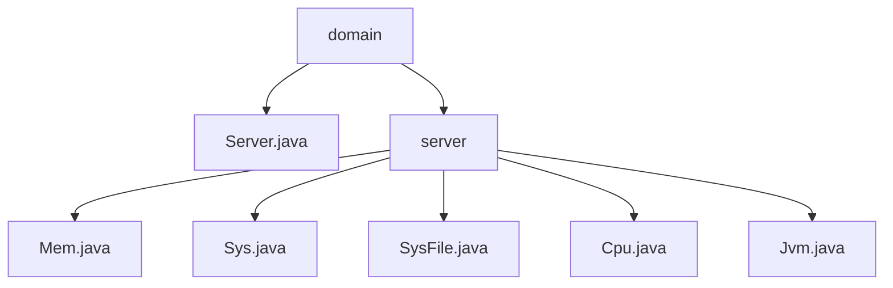

# 基础信息

|      |      |
|------|------|
| 编码语言 | .java |
| 代码路径 | RuoYi-framework/ruoyi-framework/src/main/java/com/ruoyi/framework/web/domain |
| 包名 | RuoYi-framework.ruoyi-framework.src.main.java.com.ruoyi.framework.web.domain |
| 概述说明 | Server类管理CPU、内存、JVM、服务器和磁盘信息，提供查询和配置方法。Mem类处理内存信息，Sys类管理服务器信息，SysFile类描述系统文件状态，CPU类表示CPU状态，JVM类管理Java虚拟机信息。 |

# 说明

Server类管理CPU、内存、JVM、服务器和磁盘信息，提供查询和配置方法，确保资源优化和高效运行。Mem类处理内存信息，包括总量、已用、剩余内存及使用率计算。Sys类管理服务器信息，如名称、IP、项目路径、操作系统和架构。SysFile类描述系统文件信息，包括盘符路径、类型、大小和使用率。CPU类表示CPU状态，包含核心数、使用率等属性。JVM类管理Java虚拟机内存、JDK版本、路径、启动时间和运行参数，支持监控和优化。

### 包内部结构视图

该流程图展示了RuoYi框架中web模块下的domain目录及其子目录server的文件结构。domain目录下包含一个Server.java文件和一个server子目录，server子目录下又包含了Mem.java、Sys.java、SysFile.java、Cpu.java和Jvm.java五个文件。这些文件共同构成了RuoYi框架中与服务器相关的功能模块。

# 文件列表 File List

| 名称   | 类型  | 说明 |
|-------|------|-------------|
| [Server.java](Server.md) | file | Server类管理CPU、内存、JVM、服务器和磁盘信息，并提供获取和设置方法。 |
| [server](server/_module.md) | package | Mem类管理内存信息，Sys类管理服务器信息，SysFile类描述文件信息，CPU类监控CPU状态，JVM类管理Java虚拟机。 |

