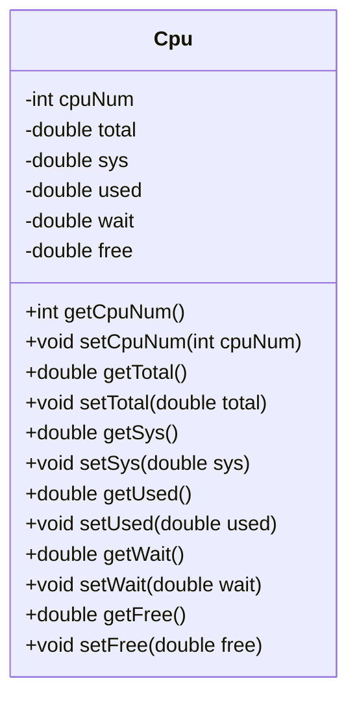

# 基础信息

|      |      |
|------|------|
| 编码语言 | .java |
| 代码路径 | RuoYi-framework/ruoyi-framework/src/main/java/com/ruoyi/framework/web/domain/server/Cpu.java |
| 包名 | com.ruoyi.framework.web.domain.server |
| 依赖项 | ['com.ruoyi.common.utils.Arith'] |
| 概述说明 | CPU类包含核心数、使用率等属性，提供getter和setter方法。 |

# 说明

CPU类是一个用于表示CPU状态的数据结构，包含多个关键属性。这些属性包括核心数、总使用率、系统使用率、用户使用率、等待率和空闲率。每个属性都通过getter和setter方法进行访问和修改，确保数据的封装性和灵活性。核心数表示CPU的物理核心数量，总使用率反映CPU的整体利用率，系统使用率和用户使用率分别表示系统进程和用户进程对CPU的占用情况，等待率表示CPU在等待I/O操作完成的时间占比，空闲率则表示CPU处于空闲状态的时间占比。通过这些属性，可以全面监控和分析CPU的性能和使用情况。

# 类列表 Class Summary

| 名称   | 类型  | 说明 |
|-------|------|-------------|
| Cpu | class | CPU类包含核心数、总使用率、系统使用率、用户使用率、等待率和空闲率等属性，并提供相应getter和setter方法。 |

## 类 Cpu

|      |      |
|------|------|
| 访问范围 | public |
| 类型 | class |
| 名称 | Cpu |
| 说明 | CPU类包含核心数、总使用率、系统使用率、用户使用率、等待率和空闲率等属性，并提供相应getter和setter方法。 |

### UML类图

该代码定义了一个 `Cpu` 类，用于表示CPU的相关信息，包括核心数、总使用率、系统使用率、用户使用率、等待率和空闲率。类中提供了对这些属性的获取和设置方法，并且在使用率相关的获取方法中，通过 `Arith` 类进行四舍五入和乘法运算，确保返回的值为百分比形式。该类主要用于管理和计算CPU的使用情况，适用于监控系统性能的场景。

### 内部方法调用关系图

```mermaid
graph TD
    A["类Cpu"]
    B["属性: int cpuNum"]
    C["属性: double total"]
    D["属性: double sys"]
    E["属性: double used"]
    F["属性: double wait"]
    G["属性: double free"]
    H["方法: int getCpuNum()"]
    I["方法: void setCpuNum(int cpuNum)"]
    J["方法: double getTotal()"]
    K["方法: void setTotal(double total)"]
    L["方法: double getSys()"]
    M["方法: void setSys(double sys)"]
    N["方法: double getUsed()"]
    O["方法: void setUsed(double used)"]
    P["方法: double getWait()"]
    Q["方法: void setWait(double wait)"]
    R["方法: double getFree()"]
    S["方法: void setFree(double free)"]

    A --> B
    A --> C
    A --> D
    A --> E
    A --> F
    A --> G
    A --> H
    A --> I
    A --> J
    A --> K
    A --> L
    A --> M
    A --> N
    A --> O
    A --> P
    A --> Q
    A --> R
    A --> S
```

这段代码定义了一个名为`Cpu`的类，用于表示CPU的相关信息，包括核心数、总使用率、系统使用率、用户使用率、等待率和空闲率。类中提供了多个getter和setter方法，用于获取和设置这些属性的值。其中，getter方法通过调用`Arith`类的`round`和`mul`方法对数据进行处理和格式化。该类的设计主要用于管理和计算CPU的使用情况。

### 字段列表 Field List

| 名称  | 类型  | 说明 |
|-------|-------|------|
| cpuNum | int | 定义私有整型变量cpuNum。 |
| free | double | 私有双精度变量free。 |
| wait | double | 声明了一个私有的双精度浮点型变量wait。 |
| used | double | 声明了一个私有的双精度浮点型变量used。 |
| total | double | 声明一个私有的双精度浮点型变量total。 |
| sys | double | 定义了一个私有双精度浮点型变量sys。 |

### 方法列表 Method List

| 名称  | 类型  | 说明 |
|-------|-------|------|
| setWait | void | 设置等待时间的公共方法。 |
| setSys | void | 设置系统参数sys的值。 |
| setUsed | void | 该方法用于设置变量"used"的值。 |
| getCpuNum | int | 获取CPU数量的方法，返回cpuNum值。 |
| getSys | double | 该方法计算系统占比并四舍五入保留两位小数。 |
| setFree | void | 定义方法设置free属性值为输入参数。 |
| getUsed | double | 该方法计算并返回使用率，保留两位小数。 |
| getFree | double | 该方法计算并返回空闲资源占总资源的百分比，保留两位小数。 |
| getWait | double | 该方法计算等待时间占总时间的百分比并四舍五入至两位小数。 |
| getTotal | double | 该方法返回总金额，经四舍五入保留两位小数。 |
| setCpuNum | void | 设置CPU数量的方法，将参数cpuNum赋值给成员变量this.cpuNum。 |
| setTotal | void | 设置总数值的方法。 |

