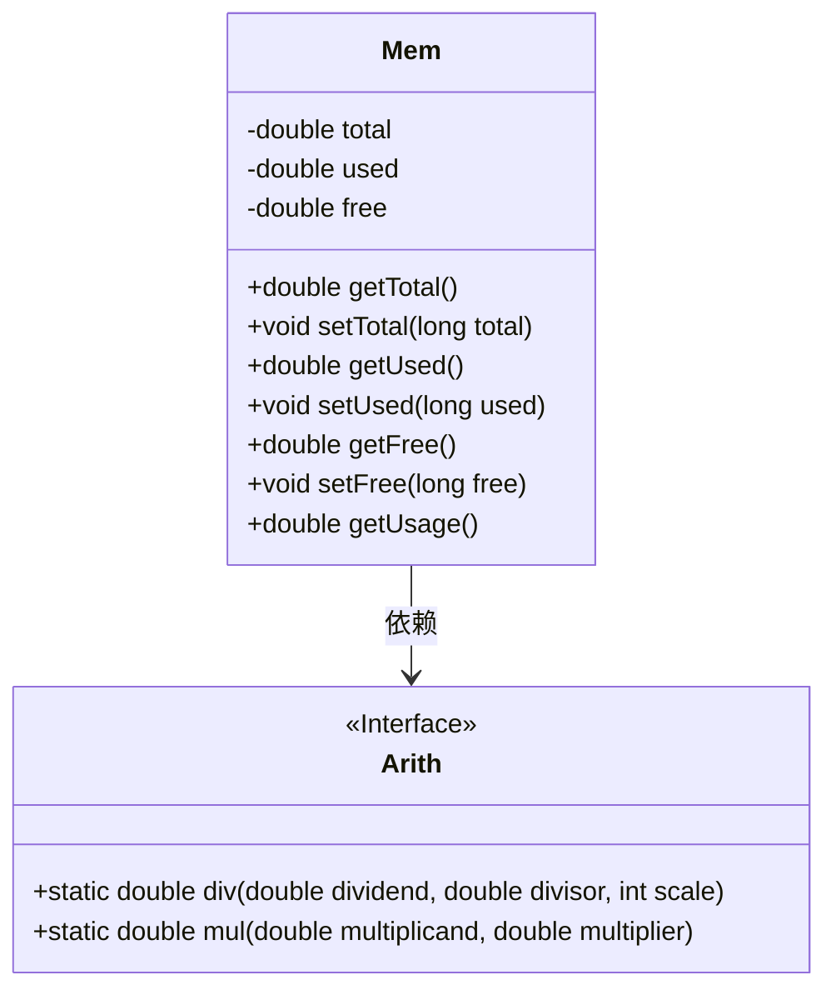
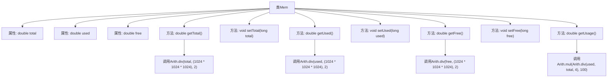

# 基础信息

|      |      |
|------|------|
| 编码语言 | .java |
| 代码路径 | RuoYi-framework/ruoyi-framework/src/main/java/com/ruoyi/framework/web/domain/server/Mem.java |
| 包名 | com.ruoyi.framework.web.domain.server |
| 依赖项 | ['com.ruoyi.common.utils.Arith'] |
| 概述说明 | Mem类管理内存信息，提供获取、设置及计算使用率功能。 |

# 说明

Mem类是一个用于管理内存信息的工具类，它包含内存总量、已用内存和剩余内存三个关键属性。该类提供了获取和设置这些内存信息的方法，并能够计算当前内存的使用率。通过Mem类，用户可以方便地监控和管理系统内存状态，确保内存资源的有效利用。

# 类列表 Class Summary

| 名称   | 类型  | 说明 |
|-------|------|-------------|
| Mem | class | Mem类用于管理内存信息，包含总量、已用和剩余内存，提供获取和设置方法，并计算内存使用率。 |

## 类 Mem

|      |      |
|------|------|
| 访问范围 | public |
| 类型 | class |
| 名称 | Mem |
| 说明 | Mem类用于管理内存信息，包含总量、已用和剩余内存，提供获取和设置方法，并计算内存使用率。 |

### UML类图

这段代码定义了一个`Mem`类，用于管理内存信息，包括总内存、已用内存和剩余内存。`Mem`类提供了获取和设置这些内存信息的方法，并且通过`Arith`类进行精确的数学运算来计算内存的使用率和转换单位。`Arith`类是一个接口，提供了除法和乘法运算的静态方法，`Mem`类依赖`Arith`类来完成这些计算。整体设计简洁，功能明确，适合用于内存监控和管理场景。

### 内部方法调用关系图

这段代码定义了一个名为`Mem`的类，用于管理内存信息。类中包含三个私有属性：`total`（内存总量）、`used`（已用内存）和`free`（剩余内存）。类提供了获取和设置这些属性的方法，并且通过调用`Arith`类的`div`和`mul`方法，对内存数据进行格式化处理，返回以GB为单位的内存总量、已用内存、剩余内存以及内存使用率。流程图展示了类中各个方法的调用关系以及它们之间的依赖关系。

### 字段列表 Field List

| 名称  | 类型  | 说明 |
|-------|-------|------|
| total | double | 声明一个私有双精度浮点型变量total。 |
| free | double | 定义了一个私有的双精度浮点型变量free。 |
| used | double | 声明一个私有的双精度浮点型变量used。 |

### 方法列表 Method List

| 名称  | 类型  | 说明 |
|-------|-------|------|
| setUsed | void | 该方法用于设置已使用量的值。 |
| getTotal | double | 该方法计算并返回总数据量，以GB为单位，保留两位小数。 |
| getFree | double | 该方法返回以GB为单位的空闲内存大小，保留两位小数。 |
| getUsed | double | 该方法返回已使用内存量，单位为GB，保留两位小数。 |
| getUsage | double | 计算使用率，将已用值与总值相除后乘以100，保留四位小数。 |
| setFree | void | 该方法用于设置变量free的值为传入的long类型参数。 |
| setTotal | void | 该方法用于设置总数值，接受长整型参数并赋值给成员变量。 |

