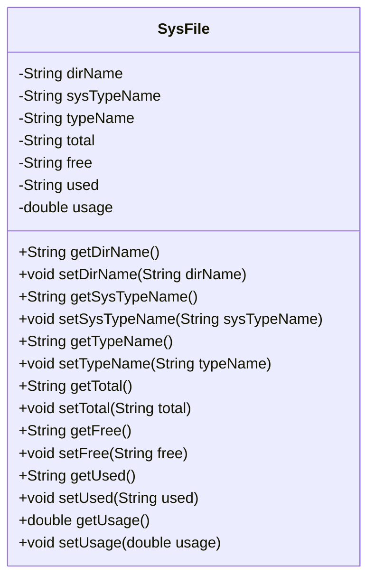

# 基础信息

|      |      |
|------|------|
| 编码语言 | .java |
| 代码路径 | RuoYi-framework/ruoyi-framework/src/main/java/com/ruoyi/framework/web/domain/server/SysFile.java |
| 包名 | com.ruoyi.framework.web.domain.server |
| 依赖项 | [] |
| 概述说明 | SysFile类包含盘符路径、类型、文件大小及使用率等属性。 |

# 说明

SysFile类是一个用于描述系统文件信息的类，包含多个关键属性。这些属性包括盘符路径，用于标识文件所在的磁盘位置；类型，用于区分文件或目录等不同种类；文件类型，用于进一步细化文件的格式或用途；总大小，表示文件或磁盘的总容量；剩余大小，表示当前可用的存储空间；已使用量，表示已被占用的存储空间；资源使用率，表示已使用量与总大小的比例，反映存储资源的利用情况。这些属性共同提供了对系统文件或磁盘状态的全面描述。

# 类列表 Class Summary

| 名称   | 类型  | 说明 |
|-------|------|-------------|
| SysFile | class | SysFile类包含盘符路径、类型、文件类型、总大小、剩余大小、已使用量及资源使用率等属性。 |

## 类 SysFile

|      |      |
|------|------|
| 访问范围 | public |
| 类型 | class |
| 名称 | SysFile |
| 说明 | SysFile类包含盘符路径、类型、文件类型、总大小、剩余大小、已使用量及资源使用率等属性。 |

### UML类图

**描述：**  
`SysFile` 类用于表示系统文件的相关信息，包括盘符路径、盘符类型、文件类型、总大小、剩余大小、已使用量以及资源使用率。该类提供了对这些属性的获取和设置方法，允许外部代码访问和修改这些信息。通过封装这些属性，`SysFile` 类能够有效地管理文件系统的状态，并为其他模块提供必要的文件信息。

### 内部方法调用关系图

```mermaid
graph TD
    A["类SysFile"]
    B["属性: String dirName"]
    C["属性: String sysTypeName"]
    D["属性: String typeName"]
    E["属性: String total"]
    F["属性: String free"]
    G["属性: String used"]
    H["属性: double usage"]
    I["方法: String getDirName()"]
    J["方法: void setDirName(String dirName)"]
    K["方法: String getSysTypeName()"]
    L["方法: void setSysTypeName(String sysTypeName)"]
    M["方法: String getTypeName()"]
    N["方法: void setTypeName(String typeName)"]
    O["方法: String getTotal()"]
    P["方法: void setTotal(String total)"]
    Q["方法: String getFree()"]
    R["方法: void setFree(String free)"]
    S["方法: String getUsed()"]
    T["方法: void setUsed(String used)"]
    U["方法: double getUsage()"]
    V["方法: void setUsage(double usage)"]

    A --> B
    A --> C
    A --> D
    A --> E
    A --> F
    A --> G
    A --> H
    A --> I
    A --> J
    A --> K
    A --> L
    A --> M
    A --> N
    A --> O
    A --> P
    A --> Q
    A --> R
    A --> S
    A --> T
    A --> U
    A --> V
```

这段代码定义了一个名为`SysFile`的类，用于管理文件系统的相关信息。类中包含多个属性，如盘符路径、盘符类型、文件类型、总大小、剩余大小、已经使用量和资源使用率等。每个属性都有对应的`getter`和`setter`方法，用于获取和设置这些属性的值。代码结构清晰，属性与方法之间的映射关系明确，便于对文件系统信息进行管理和操作。

### 字段列表 Field List

| 名称  | 类型  | 说明 |
|-------|-------|------|
| typeName | String | 定义私有字符串变量typeName。 |
| free | String | 私有字符串变量`free`。 |
| usage | double | 定义了一个私有的双精度浮点型变量usage。 |
| total | String | 定义了一个私有字符串变量total。 |
| sysTypeName | String | 私有字符串变量sysTypeName。 |
| used | String | 私有字符串变量声明。 |
| dirName | String | 定义私有字符串变量dirName。 |

### 方法列表 Method List

| 名称  | 类型  | 说明 |
|-------|-------|------|
| setSysTypeName | void | 设置系统类型名称的方法。 |
| getTypeName | String | 该方法返回类型名称的字符串。 |
| setDirName | void | 方法设置目录名属性。 |
| setUsed | void | 设置used属性的方法。 |
| getUsage | double | 获取usage值的公共方法。 |
| getDirName | String | 获取目录名称的方法。 |
| getSysTypeName | String | 获取系统类型名称的方法。 |
| getTotal | String | 该方法返回变量total的值。 |
| getFree | String | 获取free变量的字符串值。 |
| setTypeName | void | 该方法用于设置类型名称，将传入的字符串赋值给类成员变量。 |
| setUsage | void | 设置使用量方法，接受双精度参数并赋值给实例变量。 |
| setFree | void | 该方法用于设置free属性的值。 |
| setTotal | void | 设置总数值的方法，将传入的total赋值给类的成员变量。 |
| getUsed | String | 定义了一个公共方法`getUsed`，返回字符串类型变量`used`。 |

