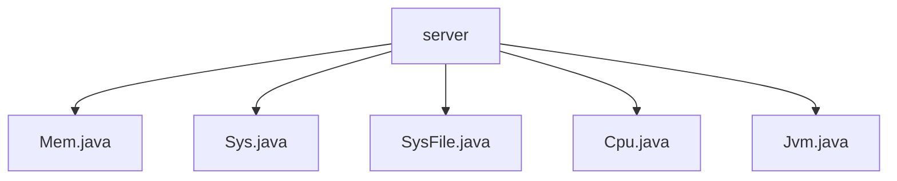

# 基础信息

|      |      |
|------|------|
| 编码语言 | .java |
| 代码路径 | RuoYi-framework/ruoyi-framework/src/main/java/com/ruoyi/framework/web/domain/server |
| 包名 | RuoYi-framework.ruoyi-framework.src.main.java.com.ruoyi.framework.web.domain.server |
| 概述说明 | Mem类管理内存信息，Sys类管理服务器信息，SysFile类描述文件信息，CPU类监控CPU状态，JVM类管理Java虚拟机。 |

# 说明

Mem类用于管理内存信息，包含内存总量、已用内存和剩余内存属性，提供获取、设置及计算内存使用率的方法。Sys类管理服务器信息，包含服务器名称、IP地址、项目路径、操作系统和系统架构属性，配有相应的getter和setter方法。SysFile类描述系统文件信息，包含盘符路径、类型、文件类型、总大小、剩余大小、已使用量和资源使用率等属性，全面反映文件或磁盘状态。CPU类表示CPU状态，包含核心数、总使用率、系统使用率、用户使用率、等待率和空闲率属性，通过getter和setter方法访问和修改。JVM类管理Java虚拟机内存、JDK版本、路径、启动时间及运行参数，支持内存监控、JDK版本切换、路径管理、启动时间记录和运行参数优化。

### 包内部结构视图

该流程图展示了`server`文件夹下的文件层级关系。`server`作为根节点，包含了五个文件：`Mem.java`、`Sys.java`、`SysFile.java`、`Cpu.java`和`Jvm.java`。这些文件直接隶属于`server`文件夹，没有进一步的子文件夹或嵌套结构。

# 文件列表 File List

| 名称   | 类型  | 说明 |
|-------|------|-------------|
| [Jvm.java](Jvm.md) | file | JVM类管理内存、JDK版本、路径、启动时间及运行参数。 |
| [Cpu.java](Cpu.md) | file | CPU类包含核心数、使用率等属性，提供getter和setter方法。 |
| [SysFile.java](SysFile.md) | file | SysFile类包含盘符路径、类型、文件大小及使用率等属性。 |
| [Sys.java](Sys.md) | file | Sys类包含服务器信息属性及访问方法。 |
| [Mem.java](Mem.md) | file | Mem类管理内存信息，提供获取、设置及计算使用率功能。 |

