# 基础信息

|      |      |
|------|------|
| 编码语言 | .java |
| 代码路径 | RuoYi-framework/ruoyi-framework/src/main/java/com/ruoyi/framework/web/exception/GlobalExceptionHandler.java |
| 包名 | com.ruoyi.framework.web.exception |
| 依赖项 | ['javax.servlet.http.HttpServletRequest', 'org.apache.shiro.authz.AuthorizationException', 'org.slf4j.Logger', 'org.slf4j.LoggerFactory', 'org.springframework.validation.BindException', 'org.springframework.web.HttpRequestMethodNotSupportedException', 'org.springframework.web.bind.MissingPathVariableException', 'org.springframework.web.bind.annotation.ExceptionHandler', 'org.springframework.web.bind.annotation.RestControllerAdvice', 'org.springframework.web.method.annotation.MethodArgumentTypeMismatchException', 'org.springframework.web.servlet.ModelAndView', 'com.ruoyi.common.core.domain.AjaxResult', 'com.ruoyi.common.core.text.Convert', 'com.ruoyi.common.exception.DemoModeException', 'com.ruoyi.common.exception.ServiceException', 'com.ruoyi.common.utils.ServletUtils', 'com.ruoyi.common.utils.StringUtils', 'com.ruoyi.common.utils.html.EscapeUtil', 'com.ruoyi.common.utils.security.PermissionUtils'] |
| 概述说明 | 全局异常处理器处理权限、请求方式、运行时、系统、业务等异常，返回错误信息。 |

# 说明

全局异常处理器是一个用于捕获和处理各类异常的系统组件。它能够处理权限异常、请求方式异常、运行时异常、系统异常以及业务异常等多种异常类型。当这些异常发生时，全局异常处理器会捕捉到异常，并根据异常类型生成相应的错误信息，然后将这些错误信息返回给调用方或用户，以便进行错误提示和处理。该机制有效提高了系统的健壮性和用户体验，确保异常情况能够得到及时且适当的响应。

# 类列表 Class Summary

| 名称   | 类型  | 说明 |
|-------|------|-------------|
| GlobalExceptionHandler | class | 全局异常处理器，处理权限、请求方式、运行时、系统、业务等异常，返回相应错误信息。 |

## 类 GlobalExceptionHandler

|      |      |
|------|------|
| 访问范围 | @RestControllerAdvice;public |
| 类型 | class |
| 名称 | GlobalExceptionHandler |
| 说明 | 全局异常处理器，处理权限、请求方式、运行时、系统、业务等异常，返回相应错误信息。 |

### UML类图

```mermaid
classDiagram
    class GlobalExceptionHandler {
        -Logger log
        +Object handleAuthorizationException(AuthorizationException e, HttpServletRequest request)
        +AjaxResult handleHttpRequestMethodNotSupported(HttpRequestMethodNotSupportedException e, HttpServletRequest request)
        +AjaxResult handleRuntimeException(RuntimeException e, HttpServletRequest request)
        +AjaxResult handleException(Exception e, HttpServletRequest request)
        +Object handleServiceException(ServiceException e, HttpServletRequest request)
        +AjaxResult handleMissingPathVariableException(MissingPathVariableException e, HttpServletRequest request)
        +AjaxResult handleMethodArgumentTypeMismatchException(MethodArgumentTypeMismatchException e, HttpServletRequest request)
        +AjaxResult handleBindException(BindException e)
        +AjaxResult handleDemoModeException(DemoModeException e)
    }

    class AuthorizationException {
        <<Exception>>
    }

    class HttpRequestMethodNotSupportedException {
        <<Exception>>
    }

    class RuntimeException {
        <<Exception>>
    }

    class Exception {
        <<Exception>>
    }

    class ServiceException {
        <<Exception>>
    }

    class MissingPathVariableException {
        <<Exception>>
    }

    class MethodArgumentTypeMismatchException {
        <<Exception>>
    }

    class BindException {
        <<Exception>>
    }

    class DemoModeException {
        <<Exception>>
    }

    class HttpServletRequest {
        <<Interface>>
    }

    class ServletUtils {
        <<Utility>>
        +static boolean isAjaxRequest(HttpServletRequest request)
    }

    class AjaxResult {
        +static AjaxResult error(String message)
    }

    class ModelAndView {
        +ModelAndView(String viewName, String modelName, Object modelObject)
    }

    GlobalExceptionHandler --> AuthorizationException : 处理
    GlobalExceptionHandler --> HttpRequestMethodNotSupportedException : 处理
    GlobalExceptionHandler --> RuntimeException : 处理
    GlobalExceptionHandler --> Exception : 处理
    GlobalExceptionHandler --> ServiceException : 处理
    GlobalExceptionHandler --> MissingPathVariableException : 处理
    GlobalExceptionHandler --> MethodArgumentTypeMismatchException : 处理
    GlobalExceptionHandler --> BindException : 处理
    GlobalExceptionHandler --> DemoModeException : 处理
    GlobalExceptionHandler --> HttpServletRequest : 依赖
    GlobalExceptionHandler --> ServletUtils : 依赖
    GlobalExceptionHandler --> AjaxResult : 依赖
    GlobalExceptionHandler --> ModelAndView : 依赖
```

### 描述
`GlobalExceptionHandler` 是一个全局异常处理类，用于捕获和处理不同类型的异常。它依赖于 `HttpServletRequest` 获取请求信息，并通过 `ServletUtils` 判断请求类型。根据不同的异常类型，返回 `AjaxResult` 或 `ModelAndView` 对象。该类处理了多种异常，包括权限校验异常、请求方式不支持异常、运行时异常、系统异常、业务异常、路径变量缺失异常、参数类型不匹配异常、自定义验证异常和演示模式异常。

### 内部方法调用关系图

```mermaid
graph TD
    A["类GlobalExceptionHandler"]
    B["属性: Logger log"]
    C["方法: handleAuthorizationException(AuthorizationException e, HttpServletRequest request)"]
    D["方法: handleHttpRequestMethodNotSupported(HttpRequestMethodNotSupportedException e, HttpServletRequest request)"]
    E["方法: handleRuntimeException(RuntimeException e, HttpServletRequest request)"]
    F["方法: handleException(Exception e, HttpServletRequest request)"]
    G["方法: handleServiceException(ServiceException e, HttpServletRequest request)"]
    H["方法: handleMissingPathVariableException(MissingPathVariableException e, HttpServletRequest request)"]
    I["方法: handleMethodArgumentTypeMismatchException(MethodArgumentTypeMismatchException e, HttpServletRequest request)"]
    J["方法: handleBindException(BindException e)"]
    K["方法: handleDemoModeException(DemoModeException e)"]

    A --> B
    A --> C
    A --> D
    A --> E
    A --> F
    A --> G
    A --> H
    A --> I
    A --> J
    A --> K
```

这段代码定义了一个全局异常处理类 `GlobalExceptionHandler`，用于捕获和处理不同类型的异常。每个 `@ExceptionHandler` 方法针对特定的异常类型进行处理，如权限校验异常、请求方式不支持异常、运行时异常等。处理方法根据请求类型（如AJAX请求）返回不同的响应结果，如JSON错误信息或错误页面。日志记录器 `log` 用于记录异常信息，帮助开发者调试和监控系统异常。

### 字段列表 Field List

| 名称  | 类型  | 说明 |
|-------|-------|------|
| log = LoggerFactory.getLogger(GlobalExceptionHandler.class) | Logger | 全局异常处理类中初始化日志记录器。 |

### 方法列表 Method List

| 名称  | 类型  | 说明 |
|-------|-------|------|
| handleMissingPathVariableException | AjaxResult | 处理缺少路径变量异常，记录错误并返回提示信息。 |
| handleHttpRequestMethodNotSupported | AjaxResult | 处理HTTP请求方法不支持的异常，记录错误并返回错误信息。 |
| handleRuntimeException | AjaxResult | 处理运行时异常，记录错误并返回错误信息。 |
| handleBindException | AjaxResult | 处理BindException异常，记录错误并返回第一条错误信息。 |
| handleMethodArgumentTypeMismatchException | AjaxResult | 处理请求参数类型不匹配异常，记录日志并返回错误信息。 |
| handleServiceException | Object | 处理ServiceException，记录错误并根据请求类型返回Ajax错误或错误页面。 |
| handleException | AjaxResult | 处理异常，记录请求地址并返回错误信息。 |
| handleDemoModeException | AjaxResult | 处理DemoModeException，返回演示模式错误信息。 |
| handleAuthorizationException | Object | 处理权限校验异常，记录错误并返回相应错误信息或页面。 |

