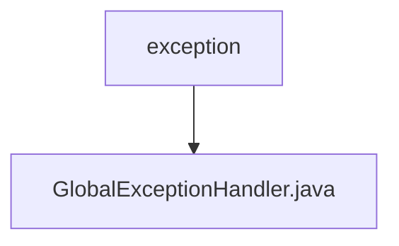

# 基础信息

|      |      |
|------|------|
| 编码语言 | .java |
| 代码路径 | RuoYi-framework/ruoyi-framework/src/main/java/com/ruoyi/framework/web/exception |
| 包名 | RuoYi-framework.ruoyi-framework.src.main.java.com.ruoyi.framework.web.exception |
| 概述说明 | 全局异常处理器处理权限、请求方式、运行时、系统、业务等异常，返回错误信息。 |

# 说明

全局异常处理器是一个用于捕获和处理各类异常的系统组件。它能够处理权限异常、请求方式异常、运行时异常、系统异常以及业务异常等多种异常类型。当这些异常发生时，全局异常处理器会捕捉到异常，并根据异常类型生成相应的错误信息，然后将这些错误信息返回给调用方或用户，以便进行错误提示和处理。该机制有效提高了系统的健壮性和用户体验，确保异常情况能够得到及时且适当的响应。

### 包内部结构视图

该流程图展示了路径的层级关系，其中`exception`文件夹包含一个名为`GlobalExceptionHandler.java`的文件。这种结构清晰地表示了文件在项目中的位置和其所属的父目录，有助于开发者快速定位和理解项目的文件组织结构。

# 文件列表 File List

| 名称   | 类型  | 说明 |
|-------|------|-------------|
| [GlobalExceptionHandler.java](GlobalExceptionHandler.md) | file | 全局异常处理器处理权限、请求方式、运行时、系统、业务等异常，返回错误信息。 |

