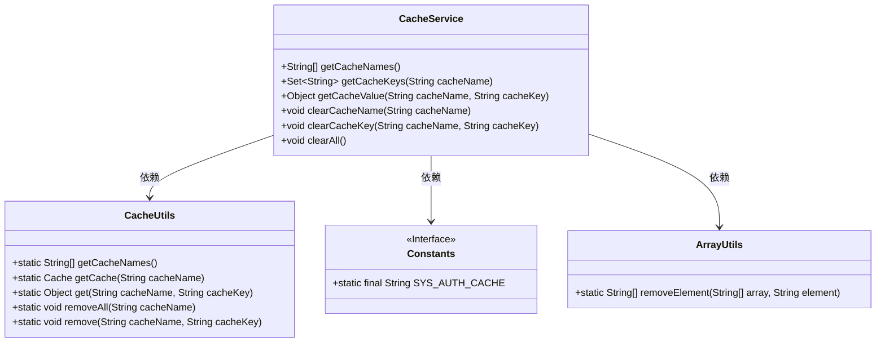
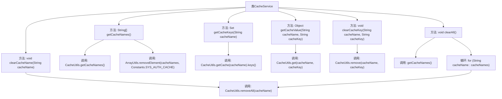

# 基础信息

|      |      |
|------|------|
| 编码语言 | .java |
| 代码路径 | RuoYi-framework/ruoyi-framework/src/main/java/com/ruoyi/framework/web/service/CacheService.java |
| 包名 | com.ruoyi.framework.web.service |
| 依赖项 | ['java.util.Set', 'java.util.TreeSet', 'org.apache.commons.lang3.ArrayUtils', 'org.springframework.stereotype.Service', 'com.ruoyi.common.constant.Constants', 'com.ruoyi.common.utils.CacheUtils'] |
| 概述说明 | CacheService类支持缓存信息的获取、删除及名称、键名、键值操作。 |

# 说明

CacheService类是一个功能模块，主要用于管理和操作缓存信息。它提供了获取和删除缓存的核心功能，支持对缓存名称、键名以及键值进行操作。通过这些功能，用户可以高效地管理和维护缓存数据，确保系统性能优化和数据一致性。

# 类列表 Class Summary

| 名称   | 类型  | 说明 |
|-------|------|-------------|
| CacheService | class | CacheService类提供获取、删除缓存信息的功能，包括缓存名称、键名、键值操作。 |

## 类 CacheService

|      |      |
|------|------|
| 访问范围 | @Service;public |
| 类型 | class |
| 名称 | CacheService |
| 说明 | CacheService类提供获取、删除缓存信息的功能，包括缓存名称、键名、键值操作。 |

### UML类图

这段代码定义了一个 `CacheService` 类，用于管理和操作缓存。它提供了获取缓存名称、缓存键名、缓存值的方法，以及清理缓存的功能。`CacheService` 依赖于 `CacheUtils` 类来执行具体的缓存操作，同时使用了 `Constants` 接口中的常量 `SYS_AUTH_CACHE` 和 `ArrayUtils` 类中的 `removeElement` 方法来处理缓存名称列表。整体设计简洁，功能明确，便于维护和扩展。

### 内部方法调用关系图

这段代码定义了一个名为`CacheService`的类，提供了对缓存的各种操作。包括获取缓存名称、根据缓存名称获取键名、根据缓存名称和键名获取内容值、根据名称删除缓存信息、根据名称和键名删除缓存信息以及清理所有缓存。每个方法都调用了`CacheUtils`类的相应方法来完成具体操作。`clearAll`方法通过调用`getCacheNames`获取所有缓存名称，并循环调用`CacheUtils.removeAll`来清理所有缓存。

### 字段列表 Field List

| 名称  | 类型  | 说明 |
|-------|-------|------|

### 方法列表 Method List

| 名称  | 类型  | 说明 |
|-------|-------|------|
| getCacheNames | String[] | 该方法获取缓存名称数组并移除系统认证缓存后返回。 |
| getCacheKeys | Set<String> | 获取指定缓存名称的所有键，返回排序后的字符串集合。 |
| clearCacheKey | void | 清除指定缓存名称和键的缓存项。 |
| clearCacheName | void | 清除指定缓存名称的所有缓存数据。 |
| clearAll | void | 该方法用于清除所有缓存，遍历缓存名称并逐个移除。 |
| getCacheValue | Object | 方法getCacheValue通过CacheUtils获取指定缓存名称和键的值。 |

