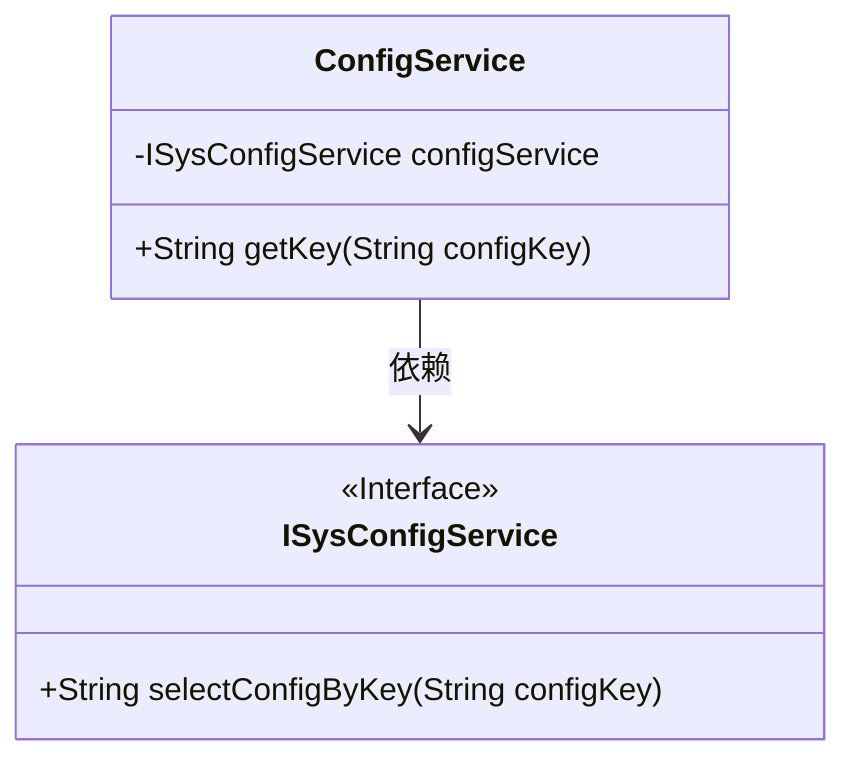
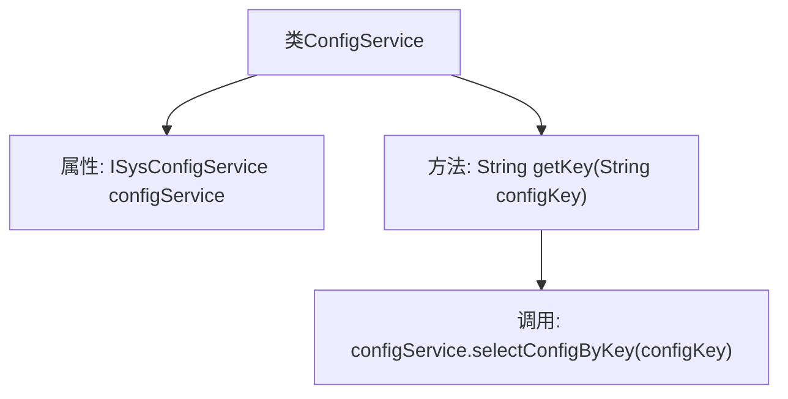

# 基础信息

|      |      |
|------|------|
| 编码语言 | .java |
| 代码路径 | RuoYi-framework/ruoyi-framework/src/main/java/com/ruoyi/framework/web/service/ConfigService.java |
| 包名 | com.ruoyi.framework.web.service |
| 依赖项 | ['org.springframework.beans.factory.annotation.Autowired', 'org.springframework.stereotype.Service', 'com.ruoyi.system.service.ISysConfigService'] |
| 概述说明 | ConfigService类根据configKey查询并返回配置信息。 |

# 说明

ConfigService类的主要功能是通过指定的configKey查询并返回相应的配置信息。该类负责处理配置数据的检索，确保能够根据传入的键值准确地获取所需的配置内容。这一过程简化了配置管理，使得应用程序能够动态地获取和更新配置信息，提高了系统的灵活性和可维护性。

# 类列表 Class Summary

| 名称   | 类型  | 说明 |
|-------|------|-------------|
| ConfigService | class | ConfigService类通过configKey查询并返回配置信息。 |

## 类 ConfigService

|      |      |
|------|------|
| 访问范围 | @Service("config");public |
| 类型 | class |
| 名称 | ConfigService |
| 说明 | ConfigService类通过configKey查询并返回配置信息。 |

### UML类图

类图描述：`ConfigService`类依赖于`ISysConfigService`接口，通过`@Autowired`注解注入`configService`实例。`ConfigService`类提供了`getKey`方法，用于根据键名查询参数配置信息，该方法内部调用了`ISysConfigService`接口的`selectConfigByKey`方法。`ISysConfigService`接口定义了`selectConfigByKey`方法，具体实现由其他类完成。

### 内部方法调用关系图

这段代码定义了一个名为 `ConfigService` 的服务类，其中包含一个 `ISysConfigService` 类型的属性 `configService`，并通过 `@Autowired` 注解进行自动注入。`getKey` 方法接收一个 `configKey` 参数，并调用 `configService.selectConfigByKey(configKey)` 方法来获取相应的配置值。流程图展示了类的结构及其内部方法调用关系。

### 字段列表 Field List

| 名称  | 类型  | 说明 |
|-------|-------|------|
| configService | ISysConfigService | 自动注入系统配置服务实例。 |

### 方法列表 Method List

| 名称  | 类型  | 说明 |
|-------|-------|------|
| getKey | String | 该方法通过配置键获取配置值。 |

