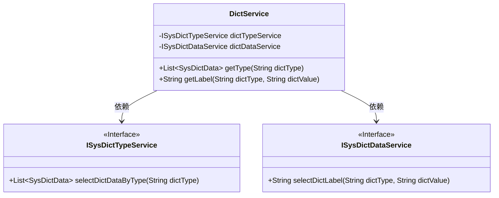
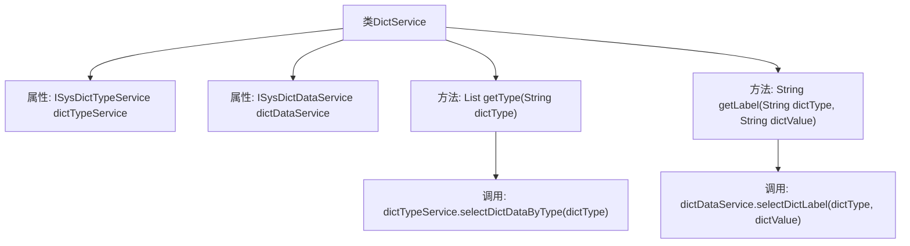

# 基础信息

|      |      |
|------|------|
| 编码语言 | .java |
| 代码路径 | RuoYi-framework/ruoyi-framework/src/main/java/com/ruoyi/framework/web/service/DictService.java |
| 包名 | com.ruoyi.framework.web.service |
| 依赖项 | ['java.util.List', 'org.springframework.beans.factory.annotation.Autowired', 'org.springframework.stereotype.Service', 'com.ruoyi.common.core.domain.entity.SysDictData', 'com.ruoyi.system.service.ISysDictDataService', 'com.ruoyi.system.service.ISysDictTypeService'] |
| 概述说明 | DictService类支持按类型或类型加键值查询字典数据。 |

# 说明

DictService类是一个用于查询字典数据的工具，支持两种主要查询方式：一种是按类型查询，即根据字典数据的分类进行检索；另一种是按类型及键值查询，即在特定分类下根据具体键值进行精确查找。该类功能全面，能够满足不同场景下的字典数据查询需求。

# 类列表 Class Summary

| 名称   | 类型  | 说明 |
|-------|------|-------------|
| DictService | class | DictService类提供查询字典数据功能，包括按类型查询和按类型及键值查询。 |

## 类 DictService

|      |      |
|------|------|
| 访问范围 | @Service("dict");public |
| 类型 | class |
| 名称 | DictService |
| 说明 | DictService类提供查询字典数据功能，包括按类型查询和按类型及键值查询。 |

### UML类图

类图描述：`DictService` 类依赖于两个接口 `ISysDictTypeService` 和 `ISysDictDataService`，分别用于查询字典数据和字典标签。`DictService` 提供了两个公有方法：`getType` 用于根据字典类型查询字典数据，`getLabel` 用于根据字典类型和键值查询字典标签。接口 `ISysDictTypeService` 和 `ISysDictDataService` 分别定义了查询字典数据和字典标签的方法。

### 内部方法调用关系图

这段代码定义了一个名为 `DictService` 的服务类，该类通过 `@Autowired` 注入了两个依赖项：`ISysDictTypeService` 和 `ISysDictDataService`。类中提供了两个方法：`getType` 和 `getLabel`。`getType` 方法根据字典类型查询字典数据信息，并调用 `dictTypeService.selectDictDataByType` 方法获取结果。`getLabel` 方法根据字典类型和字典键值查询字典标签，并调用 `dictDataService.selectDictLabel` 方法获取结果。流程图展示了类的属性和方法之间的调用关系。

### 字段列表 Field List

| 名称  | 类型  | 说明 |
|-------|-------|------|
| dictDataService | ISysDictDataService | 自动注入字典数据服务实例。 |
| dictTypeService | ISysDictTypeService | 自动注入系统字典类型服务实例。 |

### 方法列表 Method List

| 名称  | 类型  | 说明 |
|-------|-------|------|
| getType | List<SysDictData> | 获取指定字典类型的数据列表。 |
| getLabel | String | 该方法通过字典类型和值获取对应标签，调用字典数据服务实现。 |

