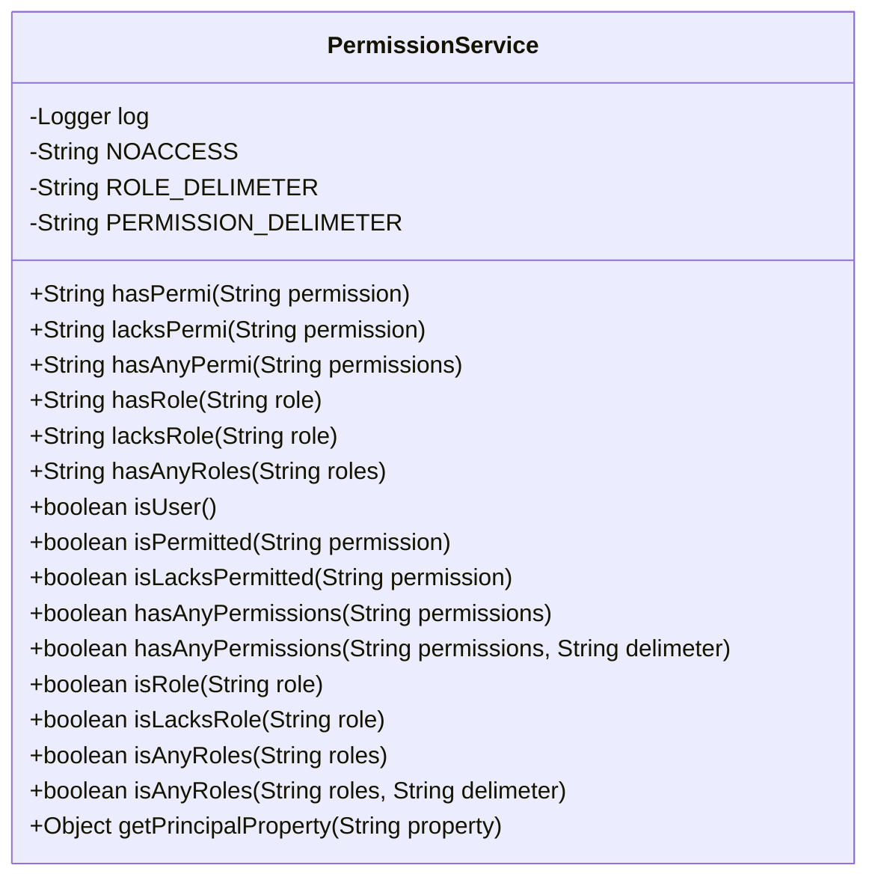

# 基础信息

|      |      |
|------|------|
| 编码语言 | .java |
| 代码路径 | RuoYi-framework/ruoyi-framework/src/main/java/com/ruoyi/framework/web/service/PermissionService.java |
| 包名 | com.ruoyi.framework.web.service |
| 依赖项 | ['java.beans.BeanInfo', 'java.beans.Introspector', 'java.beans.PropertyDescriptor', 'org.apache.shiro.SecurityUtils', 'org.apache.shiro.subject.Subject', 'org.slf4j.Logger', 'org.slf4j.LoggerFactory', 'org.springframework.stereotype.Service', 'com.ruoyi.common.utils.StringUtils'] |
| 概述说明 | PermissionService类用于验证用户权限和角色，返回hidden或无权限。 |

# 说明

PermissionService类是一个用于权限验证的功能模块，主要负责判断用户的权限和角色。它通过分析用户的权限信息，确定用户是否具备访问特定资源或执行特定操作的资格。根据验证结果，PermissionService类会返回相应的状态，如“hidden”表示用户无权查看该资源，或直接返回“无权限”提示。该类的核心功能是确保系统资源的安全性，防止未授权用户访问敏感信息或执行受限操作。

# 类列表 Class Summary

| 名称   | 类型  | 说明 |
|-------|------|-------------|
| PermissionService | class | PermissionService类提供权限验证功能，判断用户权限和角色，返回hidden或无权限。 |

## 类 PermissionService

|      |      |
|------|------|
| 访问范围 | @Service("permission");public |
| 类型 | class |
| 名称 | PermissionService |
| 说明 | PermissionService类提供权限验证功能，判断用户权限和角色，返回hidden或无权限。 |

### UML类图

这段代码定义了一个名为 `PermissionService` 的类，主要用于权限验证和用户角色管理。该类包含多个方法，用于检查用户是否具备特定权限或角色，并根据结果返回相应的字符串或布尔值。类中还定义了一些常量，如权限和角色的分隔符，以及表示无权限的字符串 `NOACCESS`。通过这些方法，可以方便地进行权限控制，并根据需要隐藏或显示前端按钮。

### 内部方法调用关系图

```mermaid
graph TD
    A["类PermissionService"]
    B["属性: Logger log"]
    C["属性: String NOACCESS"]
    D["属性: String ROLE_DELIMETER"]
    E["属性: String PERMISSION_DELIMETER"]
    F["方法: String hasPermi(String permission)"]
    G["方法: String lacksPermi(String permission)"]
    H["方法: String hasAnyPermi(String permissions)"]
    I["方法: String hasRole(String role)"]
    J["方法: String lacksRole(String role)"]
    K["方法: String hasAnyRoles(String roles)"]
    L["方法: boolean isUser()"]
    M["方法: boolean isPermitted(String permission)"]
    N["方法: boolean isLacksPermitted(String permission)"]
    O["方法: boolean hasAnyPermissions(String permissions)"]
    P["方法: boolean hasAnyPermissions(String permissions, String delimeter)"]
    Q["方法: boolean isRole(String role)"]
    R["方法: boolean isLacksRole(String role)"]
    S["方法: boolean isAnyRoles(String roles)"]
    T["方法: boolean isAnyRoles(String roles, String delimeter)"]
    U["方法: Object getPrincipalProperty(String property)"]

    A --> B
    A --> C
    A --> D
    A --> E
    A --> F
    A --> G
    A --> H
    A --> I
    A --> J
    A --> K
    A --> L
    A --> M
    A --> N
    A --> O
    A --> P
    A --> Q
    A --> R
    A --> S
    A --> T
    A --> U
```

这段代码定义了一个名为 `PermissionService` 的类，主要用于处理用户权限验证。类中包含多个方法，用于验证用户是否具备特定权限或角色，并根据验证结果返回相应的字符串或布尔值。这些方法包括 `hasPermi`、`lacksPermi`、`hasAnyPermi`、`hasRole`、`lacksRole`、`hasAnyRoles` 等。此外，类中还包含一些辅助方法，如 `isUser` 用于验证用户是否认证通过，`getPrincipalProperty` 用于获取用户属性值。整体设计旨在提供灵活的权限验证机制，并支持前端根据权限状态隐藏或显示相关按钮。

### 字段列表 Field List

| 名称  | 类型  | 说明 |
|-------|-------|------|
| log = LoggerFactory.getLogger(PermissionService.class) | Logger | 权限服务类中定义了一个静态日志记录器。 |
| NOACCESS = "hidden" | String | 定义常量字符串NOACCESS，值为"hidden"。 |
| ROLE_DELIMETER = "," | String | 定义私有静态常量ROLE_DELIMETER，值为逗号。 |
| PERMISSION_DELIMETER = "," | String | 定义私有静态常量PERMISSION_DELIMETER，值为逗号。 |

### 方法列表 Method List

| 名称  | 类型  | 说明 |
|-------|-------|------|
| isLacksRole | boolean | 该方法检查用户是否缺少指定角色。 |
| lacksRole | String | 方法检查角色缺失，返回空或无访问权限。 |
| hasAnyPermissions | boolean | 检查用户是否拥有指定权限列表中的任一权限。 |
| hasPermi | String | 方法hasPermi检查权限，返回空字符串或无权限标识。 |
| isRole | boolean | 该方法检查当前用户是否拥有指定角色。 |
| hasAnyPermi | String | 方法检查权限，若无权限返回NOACCESS，否则返回空字符串。 |
| isUser | boolean | 该方法检查当前用户是否已认证，返回布尔值。 |
| isAnyRoles | boolean | 检查用户是否拥有指定角色中的任意一个。 |
| hasAnyPermissions | boolean | 检查是否有任意权限，使用默认分隔符。 |
| isAnyRoles | boolean | 检查角色列表是否包含任何角色。 |
| getPrincipalProperty | Object | 通过反射获取主体对象的指定属性值，处理异常并记录错误日志。 |
| hasRole | String | 方法hasRole检查角色，符合返回空字符串，否则返回NOACCESS。 |
| lacksPermi | String | 方法检查权限，若无权限返回空，否则返回无访问提示。 |
| hasAnyRoles | String | 方法hasAnyRoles检查用户是否拥有指定角色，返回空字符串或无访问权限。 |
| isPermitted | boolean | 该方法检查当前用户是否拥有指定权限。 |
| isLacksPermitted | boolean | 检查权限是否缺失。 |

