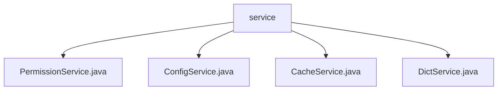

# 基础信息

|      |      |
|------|------|
| 编码语言 | .java |
| 代码路径 | RuoYi-framework/ruoyi-framework/src/main/java/com/ruoyi/framework/web/service |
| 包名 | RuoYi-framework.ruoyi-framework.src.main.java.com.ruoyi.framework.web.service |
| 概述说明 | PermissionService验证权限，ConfigService查询配置，CacheService管理缓存，DictService查询字典数据。 |

# 说明

PermissionService类用于权限验证，通过分析用户权限信息判断其是否具备访问特定资源或执行特定操作的资格，返回如“hidden”或“无权限”等状态，确保系统资源安全。ConfigService类负责通过指定configKey查询并返回配置信息，简化配置管理，提高系统灵活性和可维护性。CacheService类用于管理和操作缓存信息，提供获取和删除缓存的核心功能，优化系统性能和数据一致性。DictService类用于查询字典数据，支持按类型或按类型及键值进行检索，满足不同场景下的查询需求。

### 包内部结构视图

该流程图展示了RuoYi框架中`web/service`目录下的文件层级关系。`service`作为根节点，包含了四个子节点，分别是`PermissionService.java`、`ConfigService.java`、`CacheService.java`和`DictService.java`。这些文件都是`service`目录下的具体实现类，用于处理不同的业务逻辑。

# 文件列表 File List

| 名称   | 类型  | 说明 |
|-------|------|-------------|
| [DictService.java](DictService.md) | file | DictService类支持按类型或类型加键值查询字典数据。 |
| [CacheService.java](CacheService.md) | file | CacheService类支持缓存信息的获取、删除及名称、键名、键值操作。 |
| [ConfigService.java](ConfigService.md) | file | ConfigService类根据configKey查询并返回配置信息。 |
| [PermissionService.java](PermissionService.md) | file | PermissionService类用于验证用户权限和角色，返回hidden或无权限。 |

